# Zero — 情感引擎驱动的 AI 数字人

> 让机器**带着情绪**说话。Zero 以一套**情感引擎**为内核、以 **LLM** 为语言外壳：每一句话先被读成情绪、在引擎里按人类情感动力学演化，再由语言与表情把这份情绪自然地漏出来——不是让模型"扮演"情绪，而是让情绪真实地参与生成。

情感引擎融合了五个学科的建模视角：

- **数学** — 贝叶斯主动推断、动力系统、在线价值学习
- **心理学** — OCC 评价理论、效价-唤醒环状模型、情绪调节、评价性条件作用
- **生物学** — 面部动作单元（FACS）、自主神经生理反应
- **神经科学** — 预测编码、全局工作空间点燃、显著网络门控、杏仁核多通路、多巴胺奖赏预测误差
- **计算科学** — 多 Agent 编排（LangGraph）、多网络并行

---

## 定位与边界：这是「大脑」，不是全部

Zero 是数字人的**情感 / 认知内核**——那颗负责「产生并调制情绪」的大脑。它**不直接接管**感官与身体：

- **感知输入**（视觉 / 语音 / 生理信号 / 面部…）与**执行操控**（形象驱动 / 动作 / 对外动作）封装在一个**配套项目**里、作为 **MCP client** 接入。本内核**已内建 MCP server**——把一次情感引擎会话暴露为 `open_session / step / close_session / describe_config / purge_session` **五工具**（本地 stdio / 远程 streamable-http，带 Bearer 鉴权），配套项目作为 client **已端到端接通**：每轮透传会话身份、喂入 `(v,a)` 刺激与可选多模态先验，即可推进会话并取回情绪化输出。前三个是会话主回路；`describe_config` 是**只读回读面**（不传会话 id 回服务端默认配置，传了回该会话真实生效的开关与能力，供 client 在发某类流之前先确认服务端开关状态）；`purge_session` 按会话 id **删掉该会话的持久运行态**——与 `close_session` 语义不同：close 只释放连接与登记，purge 才真正删数据（不可逆）。
- 因此本仓库当前以**文本进、情绪化文本 + 通道值出**跑通内核回路；`main.py` / CLI 是**单跑内核的验证路径**——更丰富的多模态输入与操控经**已接通的 MCP 接点**驱动，且不动内核契约。
- 内核所有对外能力都**协议化、可注入**（评价桥 / 语言 / 通道解码器 / 记忆后端按协议替换），正是为了让 MCP 侧的感知与操控**接进来而不动内核契约**。

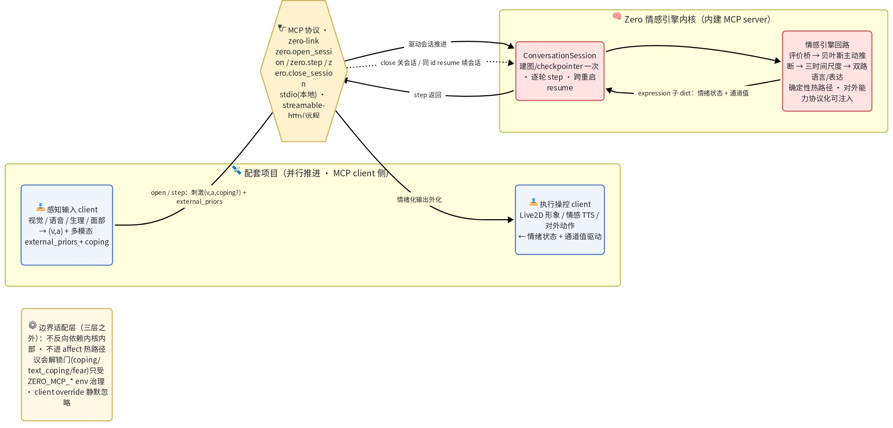

---

## 情感引擎是怎么做的

把"人产生并表达情绪"的过程，建模成一条**贝叶斯流水线**——感知一句话、推断出此刻的情绪、让它随时间演化、再分两路外化为语言和表情。

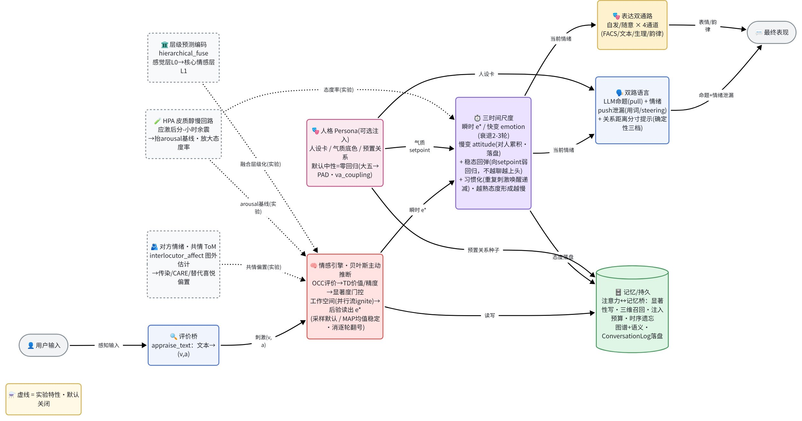

### 1. 评价桥：把话读成情绪

每一句输入先经**评价桥**反推出效价-唤醒坐标 `(v, a)`——一句夸奖是正效价、一句挑衅是负效价高唤醒——作为刺激喂给引擎。

### 2. 情感引擎核心：贝叶斯主动推断 + 显著度门控工作空间

引擎不是简单地"查表给情绪"，而是把多条**并行的功能流**竞争整合成一个全局情绪状态：

- **OCC 评价流** — 按目标契合度 / 标准符合度 / 对象吸引力给出情绪先验；
- **价值流** — 在线的 TD 奖赏预测误差与精度（对惊喜、对确定性的敏感）；
- **生存流** — 快速、低精度的亚符号信号（突如其来的巨响先于"这是什么"就拉高唤醒）；
- **语义流** — 文本/语义读出的情绪作为一条**独立、低精度**的高阶先验汇入（语言是高阶皮层的 top-down 预测，与评价、感官流并列竞争而非互相覆盖）；
- **显著度门控点燃** — 各流各出一个 `(均值, 精度)`，由显著网络打分，只有**过阈的流被"点燃"广播**进全局工作空间（全局工作空间理论的 ignition），其余停留局部、不空播。这是**默认**行为：同一个阈值同时决定「谁值得被报告」与「谁参与算数」。设 `ZERO_IGNITION_GATE_FUSION=false` 可把二者分开——阈值只留作可解释性标签，后验改由**全部流按各自精度加权**得到（阈下不显著 ≠ 对当前状态零贡献），同时去掉快生存流唤醒的常数底；⚠ 该旋钮默认 `true` 即**不**启用这套新行为，方向与其它开关相反，见配置全表；
- **精度加权融合 + 后验采样** — 参与计算的流按精度加权融合（默认=点燃的那几条；开了上面那套新行为后=全部流），采样出此刻的**瞬时情绪 e\***（随机性让同一刺激也有细微波动）；读出也可切**稳定模式**（取后验均值而非单次采样），让情绪只跟刺激走、不被单样本噪声带得逐轮乱跳（见配置 `ZERO_AFFECT_READOUT`）。

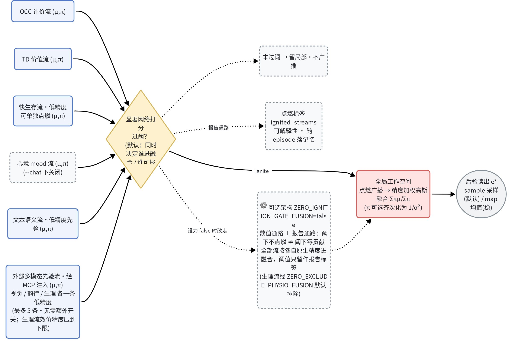

> **可选的第三维「应对潜能」（coping potential）**：效价-唤醒二维分不开「愤怒」与「恐惧」——两者都是负效价、高唤醒。引擎另设一条**独立标量流** coping_potential，由输入的**情境控制感**（control appraisal，源自 Scherer / Lazarus 评价理论）驱动，在这一象限里把「有掌控、对抗」的**愤怒**与「失控、回避」的**恐惧**分开，并可下传到表情等表达通道兑现差异。它**与核心 (v,a) 表征正交、默认关闭**（`ZERO_COPING_POTENTIAL_ENABLED`），不开启即行为不变。

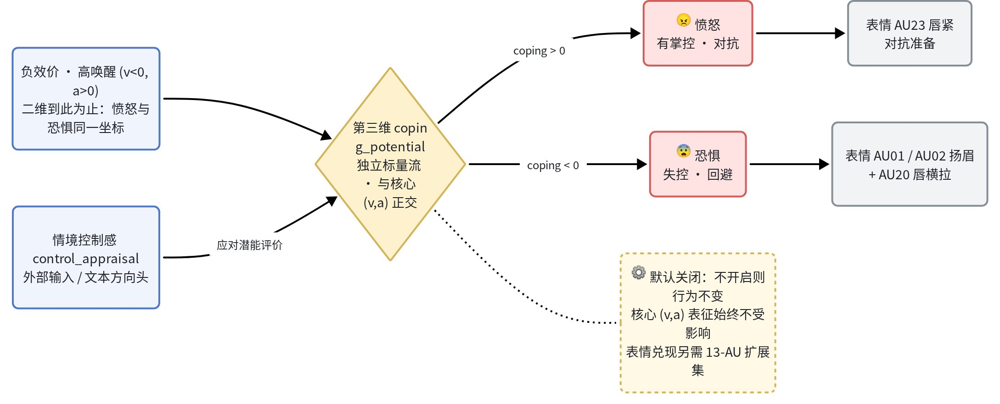

### 3. 三时间尺度：情绪会退、态度会沉淀

人的情绪不是一锤子，而是**多个时间尺度叠加**：

- **瞬时 `e*`** — 每个刺激当下采样出的情绪；
- **快变 `emotion`** — 短时情绪，被 e\* 冲击后**几轮内向基线衰退**（怒火飙起后会回落；衰退太慢反而是病理性的情绪惯性）。对外表达取的是它；
- **慢变 `attitude`** — 对**特定对象**的长期态度，按情绪缓慢累积、多轮才成形，是快变情绪衰退回归的基线。**持续**被冒犯才会真的变冷，偶尔被呛一下会过去。**只有态度被持久化**，重启后情绪归于态度基线。
- **稳态回弹** — 情绪与态度都带一份**回到平静的拉力**（向个体中性基线弱回归）：再热烈或再低落，只要没有持续刺激就会慢慢回稳，不会"越聊越上头"或陷在某个极端里出不来（affective homeostasis；情绪基线本身也是态度与中性的混合，不随态度无限上漂）。
- **唤醒双向 · 习惯化 · 分寸** — 唤醒（arousal）也是**双极**的：平淡对话会主动**降到静息**（不只是不涨）、重复互动会**习惯化**（新鲜感递减）、对刚认识的人有**分寸感**（不因聊久了就无端亲密）——从根上防「与内容无关地越聊越暧昧」（基于 seeking 吸引盆动力学；**代码内置默认是关**，而 `.env.example` 已按推荐值直接赋值——复制模板起步即为开启，注释掉对应行即回内置默认，见配置全表）。

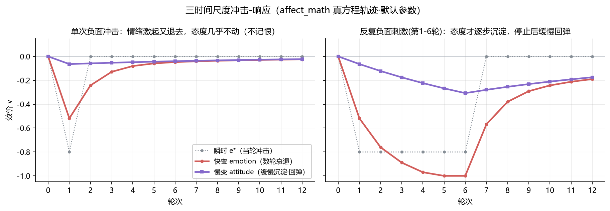

于是对话有了"脾气"：被骂会不快、道歉能缓和、但一时的情绪不会永久定义这段关系，也不会因一路投入就单调滑向极端。

### 4. 双路语言：命题靠 LLM，情绪靠"漏"

借鉴语言的皮层/皮层下双通路：

- **Pull（皮层 · 随意）** — LLM 负责**命题内容**，根据上下文与检索把"要说什么"组织成话；
- **Push（皮层下 · 不随意）** — 情绪经**用词倾向 / logit 偏置 / 隐状态 steering** 自动**漏进**输出，而不是给模型一句"请表现得很生气"。

情感**辅佐而非替换**语言：它改变措辞的温度、节奏、边界感，让回应自然带情绪，而非戏剧化地演情绪。

### 5. 表达双通路：自发与随意 × 多通道

最终表现分**自发**（真情流露）与**随意**（社交掩饰）两条通路，落到多个表达通道——面部动作单元（FACS AU）、文本标签、生理信号、语音韵律。表情通道的 AU 集可从 5 个**扩到 13 个**（含区分愤怒 / 恐惧的判别性 AU，配合上文 coping_potential），且已从**真人脸**训出真权重（emonet 面部数据集，CC-BY）；生理通道有一份对齐真实量纲（心率 / 皮电 μS / 体温 °C）的占位口径，可无缝换成 WESAD 训练的网络。

### 6. 头部动作：情绪驱动的连续轨迹

除了逐帧的通道值，内核还能产出**头部与眼球的连续运动轨迹**（20fps 关键帧），三层驱动：

1. **情绪直驱** —— 唤醒度调制幅度 / 速度 / 起始锐度；
2. **意志调控** —— 与表情同源的双通路，「压着点动作」那一路按泄漏系数衰减情绪成分，但**压不平**；
3. **语义意图** —— 从回复文本判出的离散行为（点头 / 摇头 / 歪头 / 瞥视等 12 词闭集），
   与情绪派生的连续轨迹并行。

轨迹结构是程序化基线（呼吸带、低频体态漂移、非泊松眨眼、眼-头协同）叠加情感调制的
「移动-驻留」姿态序列。运动学常数取自公开动捕数据的同域实测（StayStill / ReActIdle，
MIT 许可）：三轴幅度比、转头带侧倾的耦合、低频漂移频率等，均以真人角速度分布为标定靶子。

对外接口是 **MCP 工具 `zero.motion`**：**独立拉取、不推进引擎**——渲染端按自己的帧率
来取，情绪状态按对话回合更新，两种节拍互不牵制。相位按会话保管，跨段拼接连续。

### 7. 开口说话：语音与口型同步

回复文本经**本地 TTS**（Bert-VITS2，独立环境部署、HTTP 接入）合成语音，交由渲染端播放；
**口型由音频能量包络驱动** Live2D 嘴部参数，与音频在渲染端同一时钟内对齐（跨进程不对表）。
职责分界清晰：**嘴归语音、其余归情绪**——说话期间的表情与头部动作仍由情感引擎驱动，
语音只接管嘴部开合，两路互不越界。口型动态经对比度拉伸、开度限速与低能量忽略门塑形，
观感沉稳自然；每句合成同时产出**韵律帧序列**（时间戳 + 能量），为"说话时头动与语音
锁相"预留了数据源。语音链路全程可静默降级：TTS 或渲染端不可用时对话照常进行。

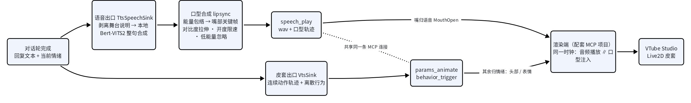

### 8. 记忆 / 持久：短时注意力 ⊗ 长时记忆

多层记忆让数字人**跨重启记得你**，并在"当下注意得过来"与"长期记得住"之间架一座桥：

- **对话运行态** — transcript 与对此人的长期态度落本地 SQLite，重启续上；态度还作为先验**偏置当下的情绪评价**（持续被冒犯，连初见的反应都会变冷）。
- **短时注意力（工作记忆窗）** — 喂给 LLM 的上下文不是简单截最近 N 轮，而是**首因 + 近因的 U 形窗**：既记得"第一次见面说的话"、也记得最近几轮（借鉴系列位置效应，避免单调截断丢掉开场）。
- **情景记忆 + 三维召回** — 把对话经历按**情绪显著性**择要写成情景 episode（平淡的不记，借鉴海马"情绪/新颖性门控"）；召回时按 **新近性 × 相关性 × 重要性** 三维加权排序（幂律时序衰减 · 语义相似 · 写入显著度），高分的旧记忆**升入注意力预算、与近期对话同台竞争**（对应皮层记忆重激活），而非旁路堆砌——于是它**记得你聊过什么**、且只在相关时想起来。
- **约定记得住、记不清就直说** — 含时间 / 地点 / 承诺的内容，即使当时情绪平淡，也经**语义重要性通道**单独入库（不被情绪显著性门挡掉），日后能答"我们约的几点"；而真记不清时会**坦诚说"不记得"**，不编造、也不拿脾气搪塞（事实优先于情绪）。
- **遗忘是特性** — 长期事实带**时序失效**（新事实使旧失效）、情景库有**容量上限**，靠自然沉降而非物理删除来遗忘；确定性图谱 + 语义召回侧信道并存，语义侧信道失败绝不拖垮主对话。另有一套 **可选的巩固与遗忘机制**（`ZERO_CONSOLIDATION_ENABLED`，默认关）：会话结束时离线触发 **Ebbinghaus 分层幂律遗忘曲线**（短期快衰、长期慢衰）+ **ACT-R 频率激活**召回排序，全程确定性、绝不每条消息触发。

> 记忆写什么/何时写/怎么召回/怎么排序，均以认知科学文献为依据定调，且**全程确定性、不让 LLM 替数字人"编造"或"挑选"记忆**。一键恢复出厂：`python -m tools.reset_db --yes`。

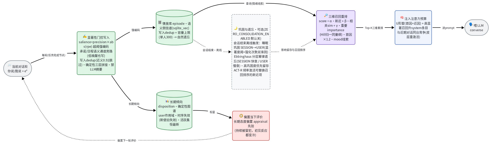

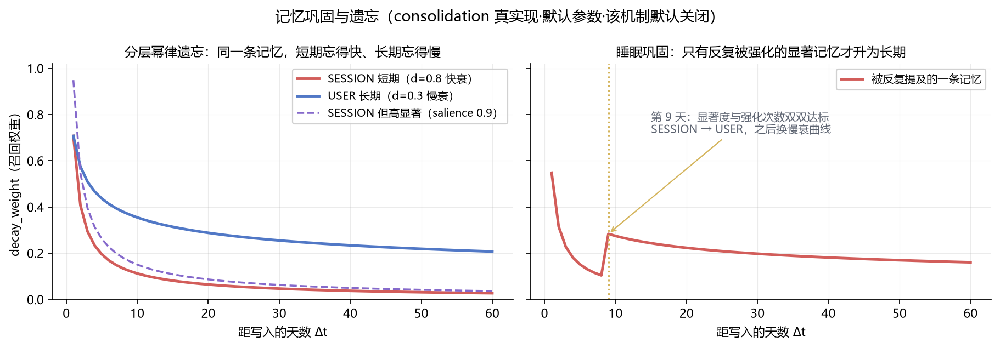

### 9. 指定人格：不必从零认识一个人

**性格该预置，关系才靠相处长**——可以给数字人指定一份**人格**，免去每次从一张白纸开始：

- **人设卡** — 名字 / 背景 / 口吻 / 与你的关系，作为身份注入对话（"它是谁"）；
- **气质底色** — 习惯性情绪基线、反应快慢与情绪恢复速度（偏暖还是偏冷、易激动还是沉稳），是性格的"生理底色"，落到引擎的态度 / 情绪参数上；也可直接填**大五人格（OCEAN 五维）**，自动映射成这份气质基线；
- **预置关系** — 初见即已有的态度（一开始就熟络 / 在意某人）+ 预灌的共同记忆（"我们一起去过海边"），跳过从零相处。

不指定时即**中性无偏人格**，默认即现有行为、不改变任何表现。"什么性格对应怎样的情绪基线"现已按 **Mehrabian 大五→PAD 映射**落地——在人格里填 OCEAN 五维即自动推导气质基线（或直接手调旋钮）；更细的预设人格库 / 精确映射仍在持续打磨，引擎不替算法臆断。

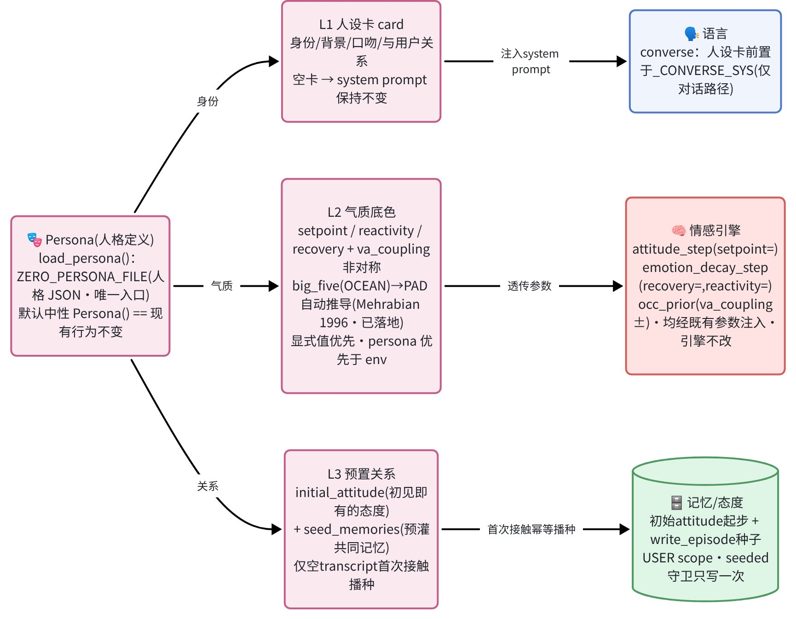

---

## 项目运作流程：LLM ⊗ 情感引擎

把上面的情感引擎接进一次完整对话——**LLM 只在「输入」「输出」两端与它结合**（图中两个蓝框）：输入端把你的话**读成情绪**，输出端**被情绪调制着说话**；夹在中间产生情绪的是那套**确定性引擎**（红框，无 LLM），LLM 既不进情绪计算热路径、也不替数字人"编造"记忆。

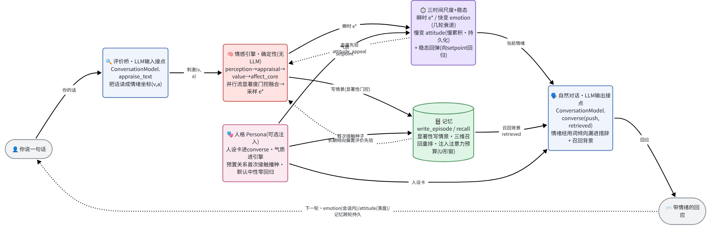

### 关键接口各自的作用（LLM ⊗ 情感接点已标注）

| 接口 / 节点 | 作用 |
| --- | --- |
| `ConversationModel.appraise_text(text) → (v,a)` | **评价桥 · LLM 输入接点**：把你的话读成情绪坐标，作为刺激喂给引擎 |
| `ConversationModel.converse(history, affect, retrieved="", *, push, relationship_hint)` | **自然对话 · LLM 输出接点**：按当前情绪 + 召回背景生成回应，情绪经用词倾向自然漏进措辞；`relationship_hint` 注入关系距离软提示（对应 `ZERO_RELATIONSHIP_STAGE_HINT`） |
| `LanguageModel.generate → LanguageDraft` | 图内 `language` 节点协议：研究模式的 affect↔language 双向收敛回路（`python main.py --llm`） |
| `ChannelDecoder`（鸭子类型注入） | 表达通道解码器：`(v,a)` → 韵律 / 生理 / 表情，可换成训练好的网络，编排层不依赖 torch |
| `MemoryClient`：`write_episode` / `recall` · `write` / `query` | 记忆读写 API：语义情景记忆（显著性写入 / 选择性召回）+ 确定性长期倾向（图谱·时序失效）；**上层不直连图谱**、写入只在任务完成节点（节流） |
| 图节点链 `memory_recall → perception → appraisal → value → affect_core → mood →（条件边）language ⇄ regulation/expression → supervisor` | 情感引擎各环：召回回灌 → 感知 → 评价先验(含长期态度/召回偏置) → 价值学习 → 显著度门控融合采样 `e*` → 慢心境 →（语言双向回路 / 掩饰）→ 多通道表达 → 任务完成节流写记忆；其中 `memory_recall` / `mood` / `language` 各由开关门控，关闭即为 no-op |
| 入口 `build_graph` · `runner.ConversationSession` · `main.py` | 装配并编译图 · 多轮会话基元（mood/价值/记忆跨轮持久）· `main.py` 是**临时验证路径**（单跑内核用，非最终对外接口——多模态输入/操控走配套 MCP） |

> 各接口均**协议化、可注入**（真 LLM / 占位模板 / steering 后端、真网络解码器、记忆后端都按协议替换），编排层不绑定具体 SDK——这是"先把对话做扎实、再逐步接多模态"而不动内核契约的底座。

---

## 预留给未来的通道

现阶段以**文本输入、情绪化文本输出**跑通整条回路，同时把若干扩展点的**接口先留好**，未来逐步接入而不动内核契约。其中**感知输入**与**执行操控**由**配套项目**承担——本内核**已内建 MCP server、配套项目作为 client 端到端接通**（见上文「定位与边界」），接点已就位、后续只是逐步接更多多模态源：

| 方向 | 现在 | 预留的未来通道 |
| --- | --- | --- |
| **表达解码器** | 各通道确定性占位；**表情通道已从真人脸训出 13-AU 真权重**（emonet CC-BY），生理通道占位已对齐真实量纲（心率 / 皮电 μS / 体温 °C） | 每个通道可**换成可训练网络**（韵律 RAVDESS / 生理 WESAD / 表情 AU 网络 / 文本→VAD EmoBank），经鸭子类型协议注入，编排层不依赖 torch |
| **输入感知**（经 MCP·**已接通**） | 文本 → `(v, a)`；MCP 接点已接通，可注入**外部多模态先验流** `external_priors`（各模态一条独立低精度 (v,a)）+ coping 第三维 | 视觉图像 / 心电（ECG）/ 语气 / 面部表情 → 更丰富的多通道感知源逐步接进评价桥与先验流 |
| **输出形态 / 操控**（经 MCP·**已接通**） | 情绪化文本 + 通道值（经 `step` 返回的 expression 子 dict）；**头部/眼球连续轨迹**经 `zero.motion` 独立拉取，已端到端驱动 Live2D 形象；**语音输出 + 口型同步**（本地 Bert-VITS2 合成，渲染端播放、能量包络驱动嘴部，见能力 7） | 说话时头动与实时语音韵律锁相（韵律帧接口已留）/ 音素级口型 / 情感化语音风格 / 更多对外动作 |
| **记忆与经历** | 对话+态度落盘、情景择要落库 + 新近×相关×重要三维召回 + 首因/近因注意力窗；**可选（默认关）：分层幂律遗忘曲线 + ACT-R 频率召回** | 稳定人格 / 自我模型、跨会话人物画像 |
| **运行后端** | 默认本地（内存 / SQLite） | env 一键切容器化 Postgres / Neo4j，接入真实图谱与运行态持久 |
| **社会认知与生理节律** | 情绪只建模自身、秒→分→天三时间尺度 | **已有实验性 v1（默认关）**：感知对方情绪并共情（ToM——对方难过则关怀 / 开心则替代喜悦）、应激后分钟-小时皮质醇余震（HPA 慢回路）、多层预测编码融合 |

---

## 项目结构

三层架构，依赖**单向**：编排 → 记忆 → 存储。

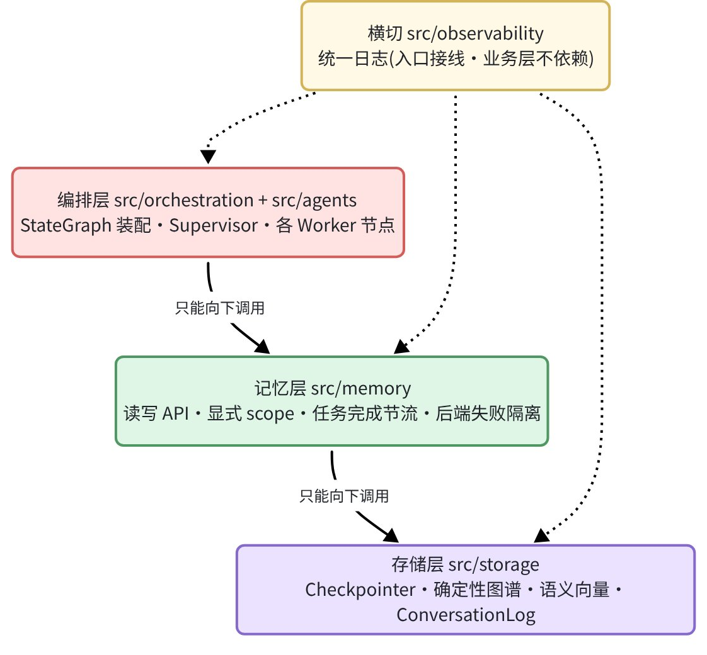

```text
Zero/
├── main.py                  # CLI 入口：默认 python main.py 即进对话；--workspace / --llm / --trace
├── src/
│   ├── orchestration/       # 编排层：StateGraph 装配 + 运行入口
│   │   ├── graph.py         #   build_graph：节点装配 + 条件边路由
│   │   ├── state.py         #   AffectState / Stimulus（结构化 state，含 recalled_facts）
│   │   ├── supervisor.py    #   协调 + 任务完成节流写记忆 + first_contact 首因标记
│   │   ├── memory_recall.py #   长期倾向回灌先验 + 召回三维重排（新近×相关×重要，Hill 归一）
│   │   ├── chat_driver.py   #   交互对话核心：两时间尺度情绪 + U形注意力窗 + 高显著召回注入
│   │   ├── runner.py        #   跑刺激序列 + 多轮对话会话（ConversationSession）
│   │   └── external_prior.py #   外部多模态先验流协议 schema：与 MCP 边界对齐的 (name,(μv,μa),(Πv,Πa)) 契约 + 版本号
│   ├── agents/              # 各 Worker（节点契约 (state) -> dict 只回增量）
│   │   ├── affect_math.py   #   数学内核：OCC/TD/精度/高斯融合·工作空间·三时间尺度
│   │   ├── perception.py · appraisal.py · value.py
│   │   ├── affect_core.py   #   主动推断·后验采样 e*（并行流竞争 + ignition）
│   │   ├── mood.py          #   慢变心境双稳动力学
│   │   ├── regulation.py · expression.py   # 掩饰 + 双通路·多通道输出
│   │   ├── language.py · language_openai.py   # 语言生成+双向回路 / ConversationModel 协议 / 评价桥 / 自然对话
│   │   ├── persona.py       #   指定人格：人设卡(L1)+气质底色(L2)+预置关系(L3)，默认中性、行为不变
│   │   ├── emotion_lexicon.py    #   细粒度情绪词 / 动机系统 / VAD 词典桥 / 时间包络
│   │   ├── motion_synth.py       #   头部/眼球连续轨迹合成器（纯函数 torch-free，给定 seed 确定性）
│   │   ├── motion.py             #   MotionAgent：按回合产出动作指令，渲染留 zero.motion 拉取侧
│   │   ├── behavior_intent.py    #   离散行为意图（12 词闭集，词法 + 舞台说明路由）
│   │   ├── language_steering.py  #   VA steering 适配器（开放权重）
│   │   ├── models/          #   可训练 torch 解码器（expression/prosody/physiology/facs〔13-AU 扩展集〕/text/direction_head〔coping 方向头〕 + composite 复合）
│   │   └── datasets/        #   DataLoader：synthetic / ravdess / wesad / emobank(+st 句向量版) / facs
│   ├── memory/              # 记忆层：读写 API（显式 scope、任务完成节流、后端失败隔离 + Fact.sim）
│   │   ├── client.py · types.py          # MemoryClient 读写 API（write/query · write_episode/recall）+ Scope/Fact 类型
│   │   └── consolidation.py · utils.py   # 记忆巩固与遗忘（Ebbinghaus 分层幂律 / ACT-R，离线批处理，确定性无 LLM）
│   ├── storage/             # 存储层（最底层）：运行态 + 长期记忆，env 选后端
│   │   ├── checkpointer.py  #   memory / sqlite(异步 AsyncSqliteSaver) / postgres(待异步接线)
│   │   ├── graph_store.py   #   门面 + 工厂
│   │   ├── conversation_log.py  #   --chat 对话运行态：transcript + 跨重启 attitude 落本地 SQLite
│   │   └── backends/        #   deterministic（InMemory/Sqlite/Neo4j）+ semantic（Graphiti/SqliteVector）
│   ├── observability/       # 横切：统一日志 setup_logging + 对话人读日志 setup_conversation_log（每启动落 logs/、级别可配）
│   ├── expression_out/      # 表现层出口（边界适配层·三层之外）：同一份情绪的多形式表现，默认全关、失败静默降级
│   │   ├── base.py · factory.py   #   ExpressionFrame + ExpressionSink 协议（纯定义）· 按 env 装配出口
│   │   ├── transport.py     #   渲染端 MCP 共享连接（皮套与语音共用一条通道）
│   │   ├── vts.py           #   皮套出口：连续动作轨迹 + 离散行为投递
│   │   ├── speech.py        #   语音出口：本地 Bert-VITS2 合成 → 渲染端播放 + 口型同步（韵律帧接口预留）
│   │   └── lipsync.py       #   口型合成：音频能量包络 → 嘴部关键帧（嘴归语音、其余归情绪）
│   └── mcp_server/          # zero-link：情感引擎会话包成 MCP 五工具（主回路 open/step/close + 只读回读 describe_config + 清持久运行态 purge_session；边界适配层·三层之外，stdio/streamable-http + Bearer 鉴权）
├── tests/                   # 单测 + 行为/记忆回归
├── scripts/                 # 训练 train_*.py + 运行入口（cli_modes 承接 main.py 三模式 / run_pipeline 端到端）+ 验证 verify_*.py（含 verify_text_input 文本输入）+ 数据构建 build_*.py + 泛化/门控评测（*_direction_ood.py · gate_*.py 等，研究用）
├── tools/                   # 运维/文档工具（reset_db.py 清库 · plot_timescales.py / plot_consolidation.py 生成曲线图）
├── docs/                    # 对外架构图 12 张（框架 / 运作流程 / 记忆架构 / 人格注入 / 三层架构 / 工作空间点燃 / 数据落点 / MCP 边界 / 第三维分岔 / 语音口型链路 + 三时间尺度·巩固遗忘两条曲线，v1·v2 谱系，详见 docs/README.md）
├── notes/                   # 研究笔记 / 设计决策 / 工程实践（本地维护、不入库）
├── DATASETS.md              # 真网络化数据集获取指南（RAVDESS / WESAD / EmoBank / FACS）
├── WEIGHTS.md               # 现成权重清单：sha256 校验值 / 网络结构 / 训练配方与实测指标
├── .env.example                                     # 配置模板（cp 为 .env 启用）
├── personas/                                        # --chat 人格卡目录：*.example.json 模板随仓库共享 / 个人 *.json 走 gitignore；放多份 persona 改 ZERO_PERSONA_FILE 即切换
├── Dockerfile · docker-compose.yml                  # 容器化部署
└── pyproject.toml · environment.yml                 # 依赖与环境（core + ml/llm/nlp/steer/db 默认装；graphiti / mcp / data / tts 按需）
```

---

## 快速开始

环境用 conda 管理（环境名 `affective-expression`，Python 3.12，依赖口径以 `pyproject.toml` 为准；也支持 `uv sync`）。

```powershell
# 1. 建环境
conda env create -f environment.yml
conda activate affective-expression

# 2. 直接对话：情感引擎 ⊗ LLM（缺 LLM key 自动回退词典 + 模板，仍演示情绪演化）
python main.py

# 3. 看显著度门控工作空间：每个刺激点燃了哪些并行流
python main.py --workspace

# 4. 核心管线 (v,a) 轨迹 JSON
python main.py --trace
```

> **对话时每轮会打印一行 trace**：`你这句≈(v,a)`（你这句被读出的情绪坐标）｜`情绪=<词>(v,a)`（数字人此刻的情绪）｜`对你的态度=(v,a)`（它对你的长期态度）——一眼看清引擎在想什么。

接**真 LLM**（OpenAI 兼容接口，本地 vLLM / 第三方网关皆可）需 `llm` extra 并在 `.env` 配置——配置只走 `.env`，代码不写死模型默认：

```powershell
pip install -e ".[llm]"
# .env 内：
#   ZERO_OPENAI_API_KEY=sk-...                  # 必填
#   ZERO_OPENAI_MODEL=<你的 key 可访问的模型 id>  # 必填
#   ZERO_OPENAI_BASE_URL=https://.../v1          # 可选
python main.py            # 真模型对话
python main.py --llm      # 四情绪场景的文本输出情绪验证（批处理）
```

**真网络化**（把表达通道换成训练好的网络）需 `ml` extra，数据集获取见 **[DATASETS.md](DATASETS.md)**：

```powershell
pip install -e ".[ml]"
python -m scripts.train_prosody --root data/ravdess                # 权重存 artifacts/，再注入管线；默认按平台判据自动停（--max-epochs 封顶），要跑固定轮数加 --stop fixed --epochs 300
python -m scripts.run_pipeline                                    # 端到端：合成训练 → 注入 → 跑（无需外部数据）
```

> **不想自己训练？直接用现成权重**：真实数据训练好的权重已随 Release 提供，拿来即用——从 [`weights-v0.1`](https://github.com/WizardHeHeJun/Zero/releases/tag/weights-v0.1)（稳定版 [`v0.1.0`](https://github.com/WizardHeHeJun/Zero/releases/tag/v0.1.0) 附件是同一份）下载 5 个 `.pt` 放入仓库根目录 `artifacts/`（已 gitignore），各 `load_*` / `scripts/*`（如 `run_pipeline`）自动加载；缺某通道回退内置默认 / 占位、不影响其它。
> - 五通道：`text_affect_regressor.pt` / `text_affect_regressor_st.pt`（文本→(v,a)，词袋 / 句向量，EmoBank）· `prosody_decoder.pt`（(v,a)→韵律，RAVDESS）· `physiology_decoder.pt`（(v,a)→生理，WESAD）· `expression_decoder.pt`（(v,a)→表情 FACS，demo）。
> - **文本通道建议用句向量版**：置 `ZERO_TEXT_AFFECT_BACKEND=st` 启用 `text_affect_regressor_st.pt`。在 EmoBank 官方留出 test 上，句向量版技能分（`1 − MSE/MSE_const`）**0.361**、词袋版仅 **0.028**——后者接近「永远预测均值」，实用价值很低。
> - ⚠ `weights-v0.1` 的两个文本权重训练时读了 EmoBank 全量（含官方 dev/test），Release 页上标注的 loss 是**训练集拟合度、不是泛化指标**。该读取缺陷已修复（现在默认只用官方 train + dev 早停），干净口径的重训结果见 [WEIGHTS.md](WEIGHTS.md)。
> - 校验值（sha256）、网络结构与训练配方见 **[WEIGHTS.md](WEIGHTS.md)**；自己重训时，权重旁会自动生成 `<权重>.pt.json` 记录该次训练的完整配方（轮数 / 学习率 / 种子 / 数据哈希 / commit）。

> **日志与排障**：每次启动落一份 `logs/zero-<时间戳>-<pid>.log`；排障时 `ZERO_LOG_LEVEL=DEBUG python main.py ...` 可看每轮引擎 `e*`、记忆读写、LLM 请求/响应等详情，默认 `INFO` 保持安静、不打扰对话。对话另落一份**人读日志** `logs/conversation-<时间戳>-<pid>.log`（每轮 user/Zero 原文 + 评价/情绪/态度 trace，默认开、`ZERO_CONVERSATION_LOG=0` 关且不落任何对话内容）。

> **开发/测试**：`pytest`（全套回归）· `ruff check . && ruff format .`（风格）· `mypy src`（类型）——保存时基础检查自动跑。

---

## 配置（`.env`）

所有运行配置都走 `.env`（复制 [.env.example](.env.example) 起步），代码不写死模型/后端默认。**不设任何变量即全内存占位、零依赖可跑**；`.env.example` 里每个变量都有一行速记，下面按用途分组给出完整说明。

**怎么读 `.env`（三类）**：

- **【必填】** 只有 `ZERO_OPENAI_API_KEY` + `ZERO_OPENAI_MODEL`（接真 LLM 用；缺了 `--chat` 自动回退词典+模板，仍能跑）。
- **后端选择**（顶部各组）：`.env.example` 里的赋值多数就是**内置默认**，写不写效果一样，想切落盘/真库才改；少数是**示例 / 推荐值**——必填的 `ZERO_OPENAI_MODEL`、语义侧信道 `ZERO_SEMANTIC_BACKEND=sqlite_vec`（`--chat` 的默认，其它入口内置默认为关）与 `ZERO_GRAPHITI_MODEL` / `_EMBED_MODEL`——以下面各表「默认」列为准。
- **可选旋钮**（底部，分两类）：**数字人对话 / 记忆组**已直接给出推荐赋值——复制即数字人推荐配置，注释掉某行 = 回内置默认；**研究级组**（workspace 精度 / HPA / ToM / 层级融合等）保持**注释** = 默认关 = 行为不变，取消注释才覆盖。最小推荐仍是两个：`ZERO_PERSONA_FILE`（治"上来就编造关系"）+ `ZERO_AFFECT_READOUT=map`（治情绪标签逐轮翻号）；`ZERO_APPRAISE_CALIBRATE` 视模型可选（强模型如 deepseek 本就把敌意读得够负、可不开）。

> **同一个 KEY 只写一行**——重复声明时后者覆盖前者。切换后端请直接改那一行的值，不要再加一行。
>
> **布尔类旋钮一律写 `1` / `0`**——各模块对 `on` / `off` / `yes` / `no` 这类写法的识别并不完全一致，个别变量遇到认不出的值会按「开」处理。下面各表标「`1` 开启」的就照写 `1`，要关就写 `0` 或整行注释掉。

### 读取时机与常见陷阱

`.env.example` 当前按**全能力验证态**赋值（真通道权重 + 情感第三维 + 人格卡 + 记忆巩固 + 语音出口均已开启，权重文件须在 `artifacts/` 下；语音出口在本地没起 Bert-VITS2 服务时静默降级、不影响对话）。整份粘贴后须改 `ZERO_OPENAI_API_KEY` 与 `ZERO_OPENAI_MODEL` 两行；要回到零依赖占位态，把「真通道解码器注入」「情感第三维」「文本情感回归」三节整节注释掉即可。

**哪些入口会读 `.env`**——库代码从不读，只有入口脚本加载，因此并非每条命令都吃这份配置：

| 入口 | 读 `.env`？ |
| --- | --- |
| `python main.py`（默认对话）· `python main.py --llm` | ✅ 读 |
| `python main.py --trace` · `--workspace` | ❌ **不读**（`scripts/cli_modes.py` 只在 `run_llm` 里加载），配置须在 shell 导出 |
| `python -m src.mcp_server` | ❌ **不读**，`ZERO_MCP_*` 一律须在 shell 导出 |
| `python -m tools.reset_db` | ✅ 读（按你配置的路径清库） |

**应用日志的目录与级别读不到 `.env`**：`setup_logging()` 在 `main()` 里先跑，`_load_dotenv()` 在 `_chat_repl()` 里后跑，所以 `ZERO_LOG_DIR` / `ZERO_LOG_LEVEL` 写进 `.env` 只对**对话日志**（`setup_conversation_log`，在 dotenv 之后初始化）生效。排障要开 DEBUG 请在 shell 导出 `ZERO_LOG_LEVEL=DEBUG`。

**留空 ≠ 关闭**，本仓两种相反行为都存在，按变量而定：

- 路径类（`ZERO_CHECKPOINT_DB` / `ZERO_GRAPH_DB` / `ZERO_SEMANTIC_DB`）**不要留空**——空串会被解析成仓库根目录。
- `ZERO_HABITUATION_TAU=` 留空会 `float("")` **启动即崩**（要关请写 `0`）；而 `ZERO_AROUSAL_GAIN_CAP=` 留空是合法的「不设上限」。
- 选了 `ZERO_SEMANTIC_BACKEND=sqlite_vec` 会连带读取 `ZERO_RECALL_SIM_MIN` / `ZERO_EPISODE_DEDUP_MAX` / `ZERO_EPISODE_MAX_PER_KEY`，这三项留空即启动失败。

**几处「设了却与预期不符」**：

- `ZERO_ATTITUDE_SETPOINT_A` 是 **env 优先**，设了就顶掉人格卡的气质基线（方向与 `ZERO_VA_COUPLING_*` 相反——那两个是 persona 优先）。用带 `setpoint` 的人格卡时应注释掉它。
- `ZERO_FACS_MODEL_PATH` 指向的权重键数须与 `ZERO_FACS_EXTENDED` 一致：仓库自带的 `facs_decoder_ext_v2.pt` 是 13 键，必须同时 `ZERO_FACS_EXTENDED=true`，否则启动即 `size mismatch` 报错（5 vs 13）。
- `ZERO_MCP_*` 与无前缀的同名变量互不覆盖，两条入口各读各的；`ZERO_FACS_EXTENDED` / `ZERO_PHYSIOLOGY_CANONICAL_PLACEHOLDER` 例外，两侧共用无前缀那一份。

### 运行后端

运行态 Checkpointer 与 长期记忆图谱**各自独立选后端**，可任意组合；默认都在内存，落盘 / 真后端按需开。

> **`--chat` 例外**：对话入口为让记忆开箱即跨会话生效，未显式设值时自动落盘——`ZERO_CHECKPOINT_BACKEND=sqlite` · `ZERO_MEMORY_BACKEND=sqlite` · `ZERO_SEMANTIC_BACKEND=sqlite_vec`（`main.py` 入口 setdefault，相应依赖缺失时优雅降级）；在 `.env` 显式设值即可覆盖。

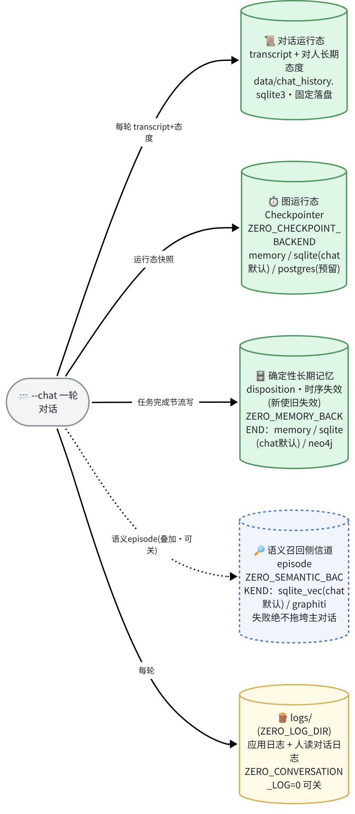

| 变量 | 默认 | 说明 |
| --- | --- | --- |
| `ZERO_CHECKPOINT_BACKEND` | `memory` | 运行态后端：`memory` / `sqlite`；`postgres` **尚未接线，设了会在会话构造时直接报错**（不是静默回退到内存），部署 PG 需先在异步入口接上 `AsyncPostgresSaver` |
| `ZERO_CHECKPOINT_DB` | `data/checkpoints.sqlite3` | sqlite 后端的库文件路径 |
| `ZERO_PG_DSN` | — | postgres 连接 DSN，为上述接线**预留**；当前代码不读取它，单设本项不会让 postgres 生效 |
| `ZERO_MEMORY_BACKEND` | `memory` | 长期记忆图谱（确定性 `(scope,key)` 失效）：`memory` / `sqlite`（落盘）/ `neo4j`（需 `db` extra） |
| `ZERO_GRAPH_DB` | `data/graph.sqlite3` | sqlite 图谱的库文件路径 |
| `ZERO_NEO4J_URI` · `_USER` · `_PASSWORD` | `bolt://localhost:7687` · `neo4j` · `password` | neo4j 连接（`ZERO_MEMORY_BACKEND=neo4j` 或 Graphiti 用 neo4j 图库时生效） |

### LLM 接入（OpenAI 兼容）

语言层（评价桥 + 自然对话）与语义记忆 embedding **共用一处** OpenAI 兼容接口，最小配置见上方「快速开始」。

| 变量 | 默认 | 说明 |
| --- | --- | --- |
| `ZERO_OPENAI_API_KEY` | — | 必填 |
| `ZERO_OPENAI_MODEL` | —（无代码默认） | **必填**，须是 key 有权限的真实模型 id（`limited` 等权限标签不是模型名、会 400；可用 `/v1/models` 列出，如 `qwen-flash` / `deepseek-v4-flash` / `gpt-5.5`） |
| `ZERO_OPENAI_BASE_URL` | `https://api.openai.com/v1` | 可指向 OpenAI / 本地 vLLM / Ollama / 第三方网关，留空用 SDK 默认 |

> 环境里已有标准的 `OPENAI_API_KEY` / `OPENAI_BASE_URL` 时，未设 `ZERO_` 前缀版本会自动沿用；两者同时存在以 `ZERO_` 版本优先。

### 语义记忆侧信道（默认关）

确定性图谱之外，可叠一条**语义召回**侧信道（向量相似召回）；默认关（`--chat` 对话入口例外、默认开 `sqlite_vec`，见上），**侧信道失败绝不拖垮主对话**。

| 变量 | 默认 | 说明 |
| --- | --- | --- |
| `ZERO_SEMANTIC_BACKEND` | 关（`--chat` 默认 `sqlite_vec`） | `sqlite_vec`（轻量、推荐）/ `graphiti`（深度集成，需 `graphiti` extra） |
| `ZERO_SEMANTIC_DB` | `data/semantic.sqlite3` | `sqlite_vec` 的落盘路径（`:memory:` 则不落盘） |
| `ZERO_GRAPHITI_DB` | `neo4j` | Graphiti 图库，复用上面 `NEO4J_*` |
| `ZERO_GRAPHITI_MODEL` | —（未设走 Graphiti 库默认） | Graphiti 抽取实体 / 关系入图谱用的对话/推理 LLM（`.env.example` 给的是示例值） |
| `ZERO_GRAPHITI_EMBED_MODEL` | `text-embedding-3-small` | 向量嵌入模型（`sqlite_vec` / `graphiti` 都用它做相似召回，须是 key 有权限的 embedding 模型；`.env.example` 给的是示例值） |

> **自查脚本**：`python -m scripts.verify_graphiti_local`——语义记忆闭环 smoke（写 episode → 语义召回 → `recalled_context` 非空即通）。**两种后端都支持**：`sqlite_vec` 只需 LLM key（无需图库服务、推荐先跑这条）；`graphiti` 另需 `graphiti` extra + 图库服务（`ZERO_GRAPHITI_DB` 默认 `neo4j`）。

### 进阶能力：真通道权重 · 情感第三维 · MCP server · 记忆巩固（默认全关，按需开启）

以下四组能力**默认关闭、不设即行为不变**，按需逐项开启即可把内核接得更"实"。

**① 真多模态通道解码器**（把确定性占位换成训练好的网络；须装 `ml` extra + 对应权重，输入侧的句向量文本回归头另需 `nlp` extra）

| 变量 | 默认 | 作用 |
| --- | --- | --- |
| `ZERO_FACS_MODEL_PATH` | —（占位） | 表情通道真权重路径；设了即加载真 FacsDecoder。权重形状须与 `ZERO_FACS_EXTENDED` 一致，否则启动即报错 |
| `ZERO_FACS_EXTENDED` | 关（5-AU） | 表情改用 13-AU 扩展集（含区分愤怒 AU23 / 恐惧 AU01·02·20 的判别性 AU，配合 coping_potential）；须配 13-AU 权重 |
| `ZERO_FACS_K_AROUSAL` · `_K_COPING` | 1.5 · 1.2 | AU 映射的唤醒 / coping 幅度系数（方向固定、仅幅度可调） |
| `ZERO_FACS_RESIDUAL_ALPHA` | 1.0 | 判别性 AU 里「占位规则 vs 真模型」的混合比：1.0=判别 AU 全用规则（保住愤怒 / 恐惧分野）、0=全用真模型（分野消失）。仅在设了真表情权重且开 13-AU 时生效 |
| `ZERO_VOLUNTARY_COPING_LEAK` | 1.0（两通路等值） | 有意做出的表情对 coping 驱动 AU 的保留比例（意志调控会压制这些 AU，Rinn 1984）；荐 0.3，仅 `ZERO_FACS_EXTENDED` 开时生效 |
| `ZERO_PROSODY_MODEL_PATH` | —（占位·倍率口径） | 韵律通道真权重（RAVDESS）；设了后韵律值由倍率翻归一 [0,1]，供情感 TTS 消费 |
| `ZERO_PHYSIOLOGY_MODEL_PATH` | —（占位） | 生理通道真权重（WESAD）；出真实量纲 心率[50,120] / 皮电 μS[0,20] / 体温 °C[30,40] |
| `ZERO_PHYSIOLOGY_CANONICAL_PLACEHOLDER` | 关 | 无真模型时把生理占位切成与真解码器同量纲的 canonical 口径；只影响「没有真权重时」的占位公式，设了真权重则以真权重为准 |
| `ZERO_TEXT_AFFECT_BACKEND` | —（走词典 / LLM 评价桥） | **输入侧**文本情感回归：设 `st` 改用训练好的句向量回归头把话读成 `(v,a)`；未设或值不是 `st` 都回退默认路径 |
| `ZERO_TEXT_AFFECT_MODEL_PATH` | — | 句向量回归头的权重路径（如 `artifacts/text_affect_regressor_st.pt`）；设了 `BACKEND=st` 却缺这项会告警并回退默认路径 |

> **输出侧三通道各自独立**，可只开其一（如只接真韵律、表情仍走占位）。权重须由对应 `scripts/train_*` 以默认架构训练；形状不符或文件不可读会在**启动时直接报错**并指出是哪个变量，不会静默退化。输入侧的文本回归头相反——加载失败只告警、回退默认评价路径，不中断运行。
>
> **生理两套占位输出的字段并不相同**——关（默认）为 心率[70,110] / 皮电[0,1] 无量纲 / 瞳孔 mm[3,5]；开为 心率[50,120] / 皮电 μS[0,20] / 体温 °C[33,36]。对接 MCP 生理映射前请确认服务端开关状态，客户端不要假定两种输出字段一致。另注意 canonical 占位与真解码器虽同量纲但**中立态基线不同**（占位皮电从 0 μS 起、真模型中立约 10 μS），两条路径只宜各自内部相对比较，不要跨路径比绝对值或共用阈值。
>
> **文本回归的自查**：`python -m scripts.verify_text_input`——不设 `ZERO_TEXT_AFFECT_BACKEND` 时演示默认路径，设了即验证「句向量回归头 → 完整管线 → `e*` + 情绪词标签」整条闭环。

**② 情感第三维 coping_potential**（负效价高唤醒象限区分愤怒 / 恐惧）

| 变量 | 默认 | 作用 |
| --- | --- | --- |
| `ZERO_COPING_POTENTIAL_ENABLED` | 关 | 开启独立的情境应对潜能标量流（由 `control_appraisal` 驱动）；核心 (v,a) 表征不受影响 |
| `ZERO_TEXT_COPING_ENABLED` · `ZERO_TEXT_COPING_PRECISION` | 关 · 0.08 | 从文本推 coping 方向先验（低精度）；须配方向头权重，仅在对抗性语境内对愤怒生效 |
| `ZERO_TEXT_DOMAIN_ENABLED` | 关 | 对话每轮由确定性词典桥判定语境（对抗 / 中性），据此把 coping 限定在合适语境、防全域误开。需与 `ZERO_TEXT_COPING_ENABLED` **同开**才对 `--chat` 生效；单开本项只做语境标注 |
| `ZERO_FEAR_DOMAIN_ENABLED` | 关 | 恐惧方向的专属开关；关闭时任何路径都不产恐惧域激活——低应对潜能场景保守回落为愤怒，对抗性语境下的愤怒判定不受此开关影响 |
| `ZERO_DIRECTION_HEAD_MODEL_PATH` | — | coping 方向头权重路径；须与 `ZERO_TEXT_COPING_ENABLED` 同设方生效。⚠ 该权重的训练语料含 CC BY-NC 成分，**仅供研究用途**，不用于商业分发 |
| `ZERO_ANGER_ABSTAIN_LOGIT_THRESHOLD` | 0.0（不弃权） | 方向头置信不足时弃权、不产 coping 先验的阈值；调高更保守，需按自己的数据重新标定 |

> **两条入口的开法不同**：MCP 接入用 `ZERO_MCP_TEXT_COPING_ENABLED`，并由 client 在请求里带上语境与应对潜能字段；`--chat` 对话则需 `ZERO_TEXT_COPING_ENABLED` 与 `ZERO_TEXT_DOMAIN_ENABLED` 同开。

**③ zero-link MCP server**（把情感引擎会话对外暴露为 `open_session / step / close_session / describe_config / purge_session` 五工具，供配套项目作 client 接入）

五个工具的分工：`open_session` 建 / 重开会话，`step` 喂一条刺激推进一轮并取回通道值，`close_session` 释放会话（幂等）；`describe_config` 是**只读**回读面——不传 `session_id` 回**部署端默认**（env 装配出的开关 + 能力 + 各版本号，供 client 在开会话之前决定发不发某类流），传了则回**该会话真实生效**的值（未知 id 视同不传），返回体带 `describe_config_version` 供字段集演进对齐；`purge_session` 按会话 id 删掉该会话的**持久运行态**（按 thread_id 清 checkpoint），返回 `{ok, purged, backend, detail}`——`ok` 只表示请求已被正确处理、`purged` 才表示是否真删掉了持久副本，两者**别合并判断**：会话已不在册（已 close，或 server 重启后从未开过）且后端是默认内存后端时，会如实回 `purged=false`，因为内存后端的运行态随会话对象消亡、本就没有持久副本可删。另注 purge 与 close 在**等锁超时**时的处置有意不同：close 仍回 `{ok:true}`（会话已摘牌、不再接新活），purge 则**上抛错误**——它是调用方显式要求的破坏性动作，静默没删比报错危险。⚠ purge **不可逆**，与 close 语义不同：close 只释放连接与登记，purge 才真正删数据。

起服务：`pip install -e ".[mcp]"` 后 `python -m src.mcp_server`。不起 server 时以下变量均无关。

| 变量 | 默认 | 作用 |
| --- | --- | --- |
| `ZERO_MCP_TRANSPORT` | `stdio` | 传输：`stdio`（本地子进程）/ `http`（streamable-http，远程） |
| `ZERO_MCP_HTTP_HOST` · `_PORT` · `_PATH` | `127.0.0.1` · `8000` · `/mcp` | HTTP 传输监听地址 / 端口 / 路径（client endpoint = host:port + path） |
| `ZERO_MCP_HTTP_TOKEN` | —（本机免鉴权） | streamable-http 的 Bearer 共享密钥；本机(loopback) 未设=免鉴权，**对外(非 loopback) 未设 token 则启动即拒绝**（不开无鉴权裸端口）。缺失或错误的 token 返回 401；client 侧需配置同一个 token 值——**两端变量名不同：Zero 侧 `ZERO_MCP_HTTP_TOKEN`，client 侧 `ZERO_HTTP_TOKEN`，各自配、值相同** |
| `ZERO_MCP_WORKSPACE_ENABLED` | 开 | 会话默认开显著度门控工作空间（否则外部先验流被整段跳过） |
| `ZERO_MCP_COPING_ENABLED` · `_TEXT_COPING_ENABLED` · `_FEAR_DOMAIN_ENABLED` | 关 | MCP 边界侧的第三维 / 文本 coping / 恐惧域开关 |
| `ZERO_MCP_PRECISION_COMMENSURABLE` · `_IGNITION_GATE_FUSION` · `_EXCLUDE_PHYSIO_FUSION` | `false` · `true` · `true` | MCP 边界侧的精度齐次化 / 点燃门是否参与数值计算 / 生理流是否排除出数值计算；语义同下文「微调旋钮·全表」⑤组的同名无前缀变量。⚠ 后两项默认就是 `true`，方向与本表其它开关相反——`true` = 沿用旧算法 |
| `ZERO_MCP_IGNITION_BETA` | —（未设 = 硬门） | 点燃软门的陡度 β。未设 = 硬阈值门（只有显著度过阈的流进数值计算）；设成任意浮点数（含 `0`）即切软门，全部并行流按 logistic 权重加权进入。与上两行同属只受 `ZERO_MCP_*` 治理的一组，client 在 `open_session` 的 config 里传同名字段被静默忽略 |
| `ZERO_MCP_MOTION_BACKEND` | `synth` | MCP 边界侧的动作轨迹产地（`synth` / `directive` / `efference`，语义同「表现层出口与动作层」表的 `ZERO_MOTION_BACKEND`）。未设或写错**回落 `synth` 并告警**、不扳倒会话开启——回落方向即最保守的零回归档。仅本变量治理，client 在 config 里传 `motion_backend` 被静默忽略 |
| `ZERO_MCP_BEHAVIOR_FEEDBACK` | 关 | MCP 边界侧的行为反馈流总门（efference 指令副本作为一条流回流进后验计算，语义同 `ZERO_BEHAVIOR_FEEDBACK`）；须配 `ZERO_MCP_MOTION_BACKEND=efference` 才有数据源。它直接改数值后验，故仅本变量治理，client 传 `behavior_feedback_enabled` 被静默忽略 |
| `ZERO_MCP_STEP_LOCK_TIMEOUT` | —（未设 = 无限等待） | `step` 等待**同会话串行锁**的超时秒数。⚠ 只对「等锁」计时，**不对「执行」计时**——超时的是排在后面的那次请求，正在跑的那一轮不受影响；因此超时的那一轮**根本没进内核、运行态未改动**，client 退避后**可原样重试**同一请求。取值须是**正的有限数**：`0`／负数／`nan` 会让锁空闲时也无条件超时（每次 `step` 必失败），`inf` 与不设等价，故这三类在读取时即被拒绝并在错误里点名该变量；要「不设超时」请**留空**，不要填 `0` |
| `ZERO_EXTERNAL_PRIOR_PRECISION_CAP` · `ZERO_MAX_EXTERNAL_STREAMS` | 0.8 · 5 | 外部多模态先验流的单条精度上界与最大流数。<br>⚠ 这些精度是**独立校准完成前的保守占位**，不是「同等地位却意外弱势」——它们**有意**低于 `ZERO_TEXT_AFFECT_PRECISION=0.3` 以保持层级；且**不随 `ZERO_PRECISION_COMMENSURABLE` 齐次化**（该开关只作用于引擎内部的四条流）。即开启齐次化后外部流相对更弱，这是已知且被接受的现状。<br>⚠ 另注：`valence` 越出 `[-1,1]` 会在边界被拒（返回错误而非静默截断），`arousal` 越界则仍按幅度截断到 1.0——这个不对称是有意的：前者是恒等透传、越界即契约违反，后者是「幅度→强度」的语义映射、截断是映射的一部分。 |

> **会话续接与安全**：默认内存后端下 server 重启即丢会话。要跨重启续会话，设 `ZERO_CHECKPOINT_BACKEND=sqlite`（+`ZERO_CHECKPOINT_DB`），client 用**同一个 `session_id`** 重新 `open_session` 即接上；session_id 失效时 `step` 返回的错误文案里含 `[zero:unknown-session]` 令牌（**位置不限、全文恰出现一次**，不是行首前缀），client 按 `re.search(r"\[zero:([a-z][a-z0-9-]*)\]")` 提取出该码即可据此重开重试。⚠ session_id 等同于该会话运行态与记忆的**访问凭据**，多用户部署必须配鉴权。
>
> **重开时先看 `interrupt_probe`**：`open_session` 的返回体是 `{session_id, resumed, interrupt_probe}`，其中 `interrupt_probe` **恒存在**，取值是显式四态——`not_probed`（新建会话，或该会话仍活跃、按原样幂等返回，没做探测）/ `clean`（探测成功且上一轮跑完整轮）/ `interrupted`（探测成功且发现上一轮停在中途，此时**另带** `interrupted_at`＝待执行节点名列表，续跑会从该处继续而非重跑整轮）/ `probe_failed`（探测本身失败＝**不可判**，须按最坏情况处理）。⚠ 判「能不能安全续跑」请读 `interrupt_probe` 的取值，**不要**靠 `interrupted_at` 这个键在不在——后者缺席同时对应「干净」「没探测」「探测失败」三种完全不同的情形。
>
> 上表中 `ZERO_MCP_COPING_ENABLED` 起的几行属于一份**治理白名单**：白名单内的字段只由服务端 env 治理，client 在 `open_session` 的 config 里传入的同名字段一律被静默忽略，防越权开启。白名单当前共 **10 项**——`coping_potential_enabled` / `text_coping_enabled` / `fear_domain_enabled` / `precision_commensurable` / `gate_fusion` / `exclude_physio_fusion` / `ignition_beta` / `canonical_physiology` / `behavior_feedback_enabled` / `motion_backend`。其中 9 项由上表带 `ZERO_MCP_` 前缀的对应变量治理（变量名与字段名并非处处逐字相同，如 `gate_fusion` 对应的是 `ZERO_MCP_IGNITION_GATE_FUSION`）；`canonical_physiology` 例外，它读的是**不带该前缀**的 `ZERO_PHYSIOLOGY_CANONICAL_PLACEHOLDER`（与生理占位口径同源，见②组）。这份名单不必照抄——`describe_config` 的返回体里就带着 `governance_gated_flags` 全表，client 运行期直接读即可。
>
> ⑤组的 `ZERO_PRECISION_COMMENSURABLE` / `ZERO_IGNITION_GATE_FUSION` / `ZERO_EXCLUDE_PHYSIO_FUSION`（无 `ZERO_MCP_` 前缀那三个）**对 MCP server 不生效**——MCP 面读的是上表带前缀的同名变量；要改服务端的融合语义，请设带前缀的那一份。
>
> ①组的通道权重旋钮与运行态后端设置对 MCP server 同样生效。

**外部先验的参考精度**：以下 `EXTERNAL_*` 是给 client 侧的**建议值**（各模态先验该盖多少置信度），Zero 端只做上界校验、不直接应用。

| 模态 | 效价 / 唤醒 | 为什么 |
| --- | --- | --- |
| 视觉面部 | 0.20 / 0.12 | 面部对效价的判别力强于唤醒，故效价精度略高 |
| 语音韵律 | 0.10 / 0.25 | 基频 / 能量对唤醒可靠、对效价正负难分；整体低于文本语义流以保先验层级 |
| 生理 | 0.001 / 0.18 | 皮电 / 心率变异 / 瞳孔对效价方向不敏感（效价精度恒被压到下限），只对唤醒有可靠贡献 |

> ⚠ **生理先验的当前状态**：默认（点燃门）架构下它按显著度正常参与竞争；一旦设 `ZERO_IGNITION_GATE_FUSION=false` 改走全流精度加权，生理流会被 `ZERO_EXCLUDE_PHYSIO_FUSION`（默认开）整条排除出数值通路、只保留可报告——公开被试数据上 EDA 的唤醒读数与真实唤醒方向不一致，宁可先不参与计算。client 照上表配了精度也不会在这种配置下生效。

**④ 记忆巩固与遗忘**（会话结束离线触发；机制见上文「遗忘是特性」）

| 变量 | 默认 | 作用 |
| --- | --- | --- |
| `ZERO_CONSOLIDATION_ENABLED` | 关 | 主门；开启后会话结束触发分层幂律遗忘衰减（关=整体不动） |
| `ZERO_CONSOLIDATION_D_USER` | 0.3 | 长期 USER 作用域情景的分层幂律遗忘指数 |
| `ZERO_CONSOLIDATION_D_SESSION` | 0.8 | 短期 SESSION 作用域的衰减指数。⚠ **当前对话管线只产 USER 作用域情景**（两处 `write_episode` 均为 `Scope.USER`），故本项当前不生效 |
| `ZERO_CONSOLIDATION_TIMEOUT` | 30.0 | 会话结束巩固的超时秒（超时降级告警、不影响对话） |
| `ZERO_ACTR_ENABLED` · `ZERO_ACTR_B_SCALE` | 关 · 3.0 | 用 ACT-R 频率激活替换召回排序的新近项（关=用幂律时序衰减）；`_B_SCALE` 越小、频率的影响越强 |
| `ZERO_RECALL_SALIENCE_DECAY` · `_KAPPA` | 关 · 1.0 | 让显著度调制召回 recency 维的衰减速率（高显著的旧事更耐遗忘）：开启后 recency 改用 `I^κ·Δt^(−d)`，满重要性时有效衰减指数缩到 `d/(1+κ)`——κ=1 即遗忘速率减半，κ=0 精确退化为原幂律。与 ACT-R 互斥：两门同开时被 ACT-R 覆盖，构造期告警 |
| `ZERO_TAG_IMPORTANCE` | 关 | 召回排序的 importance 维改吃**语义标签**派生信号（时间 / 约定 / 承诺等 tag 进 noisy-OR，不再读情绪精度 `precision=`）；遗忘调制与召回两侧读**同一个** env，保证同开同关、不存在半切换态 |

> **工程近似声明**：巩固触发是生物睡眠周期的工程近似（真实的系统级巩固跨天至周，Davis & Zhong 2017），分层幂律是快 / 慢双阶段的工程代理，并非完整的多时间尺度巩固模型。

### 表现层出口与动作层（皮套 / 语音·口型 / `zero.motion`，默认全关）

同一份情绪的对外表现形式（能力 6 / 7 的开关面）：皮套与语音两个出口共享同一条渲染端 MCP 连接，**全未开即不表现、逐字零回归**。协议分界是「表现 vs 行动」——表现类出口**运行期失败一律静默降级**（TTS 或渲染端不可用时对话照常进行），但**配置缺失是另一回事**：开了门却缺必填项会在启动时直接报错，不静默。

**动作层**（头部 / 眼球连续轨迹，见能力 6）：

| 变量 | 默认 | 作用 |
| --- | --- | --- |
| `ZERO_MOTION_ENABLED` | 关 | MCP 工具 `zero.motion` 总开关：渲染端按自己的帧率独立拉取轨迹（只读引擎状态、不推进内核）；未开时该工具返回 motion-disabled 错误 |
| `ZERO_MOTION_BACKEND` | `synth` | 轨迹产地：`synth` 拉取侧现算（默认）/ `directive` 图内 MotionAgent 决策 / `efference` 在 directive 基础上再留一份指令副本（供行为反馈流消费） |
| `ZERO_BEHAVIOR_FEEDBACK` | 关 | 行为反馈流总门（efference copy 回流进工作空间竞争，研究级）：须配 `ZERO_MOTION_BACKEND=efference` 才有数据源，且默认硬门下该低精度流恒被滤除——要真参与计算还须 `ZERO_IGNITION_GATE_FUSION=false` 或设软门 `ZERO_IGNITION_BETA` |

**表现层出口**（对话情绪 → 外部表现，见能力 7）：

| 变量 | 默认 | 作用 |
| --- | --- | --- |
| `ZERO_VTS_SINK` | 关 | 皮套出口：对话时 Live2D 形象随情绪动（连续动作轨迹 + 离散行为投递给渲染端） |
| `ZERO_VTS_MCP_REPO` | `../Zero_MCP`（本仓兄弟目录） | 渲染端（配套项目）仓路径 |
| `ZERO_VTS_TOKEN_FILE` | `data/steering/motion/vts_token` | 皮套授权 token 落盘位置 |
| `ZERO_TTS_SINK` | 关（`.env.example` 已按荐值开启） | 语音出口：回复经本地 Bert-VITS2 合成 → 渲染端播放 + 口型同步（需 `tts` extra；本地无 TTS 服务时静默降级、不影响对话） |
| `ZERO_TTS_SERVER_URL` | —（门开必填，无代码默认） | 本地 Bert-VITS2 服务地址（如 `http://127.0.0.1:5000/voice`）；开了 `ZERO_TTS_SINK` 却缺这项**启动即报错** |
| `ZERO_TTS_SPEAKER` | —（门开必填） | 说话人名（取决于所装底模）；同上，缺失启动即报错 |
| `ZERO_TTS_LANGUAGE` · `_MODEL_ID` | `ZH` · `0` | 合成语言（ZH/JP/EN）/ TTS 服务端加载的模型序号（hiyoriUI 多模型时选用）——二者是协议枚举 / 序号，故例外地带代码默认 |
| `ZERO_REGULATION_ENABLED` | 关 | 双通路调节（自发 vs 随意）总开关；开后表现层可走随意通路（社交掩饰 / 压制） |

### 指定人格（`--chat`）

给数字人指定一份人格（能力详见上文「指定人格」一节）：`ZERO_PERSONA_FILE` 指向一个**人格 JSON**（默认不设 = 中性无偏人格、即现有行为）。仓库自带一份「诚实陌生人」模板 `personas/persona.example.json`（与真正的 `personas/persona.json` 同处一目录），`cp personas/persona.example.json personas/persona.json` 改改即用（想要多重人格就在 `personas/` 放多份、切换时改 `ZERO_PERSONA_FILE` 指向即可）。字段全可选（L1 人设卡 + L2 气质底色 + L3 预置关系）——**只想要人设卡就只写 `card` 一个字段**，不必写全、也不用往 `.env` 塞长文本：

```jsonc
{
  "name": "小津",
  "card": "你叫小津，是用户多年的老友……",   // L1 人设卡
  "setpoint": [0.1, -0.05],                  // L2 气质基线 (v,a)：略偏暖、偏平静
  "reactivity": 0.6,                         // L2 对刺激的即时反应增益（↑≈神经质）
  "recovery": 0.4,                           // L2 情绪恢复残留比例（↑=情绪退得慢）
  "initial_attitude": [0.3, 0.1],            // L3 首次接触的初始态度（已经喜欢这个人）
  "seed_memories": ["我们去年夏天一起去过青岛看海", "你不吃香菜"]  // L3 预灌的共同记忆
}
```

> L2 的「大五人格 → PAD 具体数值映射 / 预设人格库」属科学决策、须有文献依据支撑；本接口只提供旋钮 + 中性默认，不替算法拍板具体性格参数。

### 对话调优与排障（对症开旋钮）

对话不对劲时，多数能靠一两个旋钮解决——先按症状开，细节见下方全表：

| 症状 | 开什么 |
| --- | --- |
| 一上来就编造共同往事 / 假装认识你 | `ZERO_PERSONA_FILE`（给它身份 +「初次见面不编造」，见上文「指定人格」） |
| 情绪标签逐轮乱跳、与内容不符（敌意却标「兴奋」） | `ZERO_AFFECT_READOUT=map`（取后验均值、消采样翻号） |
| 敌意/负面被读得太轻 | `ZERO_APPRAISE_CALIBRATE=1`（**视模型**：强模型如 deepseek 本就够负、可不开） |
| 越聊越「上头」、情绪停在高位 | 调低 `ZERO_EMOTION_BASELINE_ATTITUDE_W`（加大回中性的拉力） |
| 越聊越「暧昧」/ 关系无端升温、与对话内容脱钩 | `ZERO_INTENSITY_FLOOR=0` + `ZERO_AROUSAL_BASELINE=-0.08` + `ZERO_ATTITUDE_REVERSION_A=0.4`（去 arousal 直流偏置，见下「越聊越暧昧」全表） |

> 两个**自查脚本**（无需改代码）：`python -m scripts.verify_affect_readout`（**无需 LLM**，实证 `map` 把翻号率从 ~20% 压到 0）；`python -m scripts.verify_appraise_calibration`（**需 LLM key**，按你的模型实测标定要不要开）。

### 微调旋钮·全表

默认开箱即用（仅 `HISTORY_*` / `EMOTION_BASELINE_ATTITUDE_W` 的默认改变 `--chat`，其余默认行为不变 / 关）；设计依据见研究笔记（`notes/`，本地维护、不随仓库分发）。

**① 数字人情绪 / 对话**

| 变量 | 默认 | 作用 |
| --- | --- | --- |
| `ZERO_AFFECT_READOUT` | `sample` | 情绪读出：`map` 取后验均值（稳定，消逐轮翻号）/ `sample` 逐轮采样（默认，带随机波动） |
| `ZERO_APPRAISE_CALIBRATE` | 关 | 分级标定锚抵消 LLM 把负面读太轻的正向偏置（敌意→更负）；`1` 开启。**视模型**——强模型（deepseek 类）本就够负、可不开 |
| `ZERO_EMOTION_NOISE_STD` | 0.05 | 每轮情绪的随机噪声幅度（调小=更稳、`0`=关该噪声源） |
| `ZERO_SAMPLE_SIGMA_MAX` | 0.5 | 后验采样的逐维抖动上限（仅 `sample` 读出下生效） |
| `ZERO_CHAT_RNG_SEED` | — | 固定随机种子，贯穿引擎采样 + 情绪噪声，便于 eval 复现（留空=每次随机） |
| `ZERO_CHAT_THREAD` | `chat` | 对话线程 id：运行态 checkpoint 的 thread 与记忆的 user 作用域都用它对齐；换一个值＝另起一套关系、态度与记忆，不与旧线程串味 |
| `ZERO_PUSH_LOGIT_BIAS` | 关 | 解码期 push：情绪一致的候选词经 tiktoken（`cl100k_base`）转成 OpenAI `logit_bias` 直接偏置解码。⚠ 须与所用模型的 tokenizer 匹配，否则偏到错误 token；缺 tiktoken 或编码失败时静默回退纯 prompt 用词倾向（即默认行为） |
| `ZERO_EMOTION_BASELINE_ATTITUDE_W` | 0.6 | 情绪回落基线里「对此人态度」占比；`<1` 给回中性的拉力、防越聊越上头（`1`=不加回中性拉力） |
| `ZERO_TEMPER_VALENCE_GATE` | —（无条件注入） | 让**语气强度真正由引擎的 `e*` 驱动**。对话 system prompt 里有一段「负面时别退化成讨好型客服、该不耐烦就不耐烦」的脾气指令，它原本**无条件注入**——于是中性话题没有情绪素材时，模型改用「性格」填补空白，变成对着「外面还在下雨吗」也要反问回怼。100 轮实测显示语气强度与情绪**反相关**：情绪「平静」的 49 轮里 49% 带命令/反问/贬抑语气，而情绪明确为负的 30 轮里只有 17%。设为阈值（荐 `-0.15`）后，该段仅在 `e*` 的 valence ≤ 阈值时注入，中性对话回归中性，而「负面时别讨好」仍然保留。留空=无条件注入=旧行为逐字不变 |
| `ZERO_FACTUAL_MODE` | 关 | **事实化模式：是 AI 就是 AI，偏向事实陈述**。默认 prompt 要求模型「像真人」，模型便用人类图式补全自己没有的属性——100 轮实测里它报出具体日期「20号，周二」、编出姓名职业、描述「走到窗边撩开帘子」的身体动作，还把虚构行为当往事引用。`1` 开启后：摘掉「你是人/像真人」的身份断言，诚实条款从「记不清的别编」扩展到「无从知道的（日期/天气/自己的身世）直说没有这个信息」，且**只删身份、不删情绪**——引擎驱动的心情、脾气指令逐字保留，另加「不要说自己没有感情」的反塌陷条款。开启时另有两道**确定性机制**护航（代码强制、非提示词）：输出端自动剥离「（笑）」类括号舞台说明且净化后才进对话历史（切断模型模仿自己旧回合的滚雪球）；历史被窗口裁剪时注入一条「更早 N 条在你窗口之外」的系统事实（防「你没说过」式误断言）。代价：system prompt 约 0.5k→2.1k 字符（`--chat` 每轮多 ~1.6k 字符输入）。留空=关=旧行为逐字不变 |
| `ZERO_PUSH_NEUTRAL_DEADZONE` | 关 | 情绪用词倾向（push）的**中性死区**。倾向词按与 `e*` 的内积排序，只看方向不看模长——情绪趋零时方向纯属噪声，实测「平静」轮会被注入「暴怒/愤怒/恐惧」的用词倾向，与同一 prompt 里的「心情平静」自相矛盾。`1` 开启后，情绪模长低于中性半径（0.15）的轮次整段不注入倾向词。事实化模式开启时此死区自动生效，无需单设。留空=关=旧行为逐字不变 |

**② 治「越聊越暧昧 / 关系无端升温」**（基于 seeking 吸引盆动力学；默认全部保持现有行为，`.env.example` 已按荐值直接赋值，⭐=数字人推荐开）

| 变量 | 默认 | 作用 |
| --- | --- | --- |
| `ZERO_INTENSITY_FLOOR` | 0.2 | ⭐arousal 强度下限；设 `0` 去掉中性输入的正 arousal 直流底噪（暧昧滑移的根之一） |
| `ZERO_AROUSAL_BASELINE` | 0 | ⭐arousal 基准平移；负值（荐 -0.08）让平淡对话给零/负唤醒（副交感 vagal brake / deactivation） |
| `ZERO_ATTITUDE_REVERSION_A` | 同 valence(0.01) | ⭐态度 arousal 维**独立**回归率（荐 0.3–0.5）；令长期态度只累积效价、不累积唤醒偏置 |
| `ZERO_ATTITUDE_SETPOINT_A` | persona.setpoint[1] | 态度 arousal 回归锚；未设=取气质底色的 a、`0`=中性 |
| `ZERO_HABITUATION_TAU` | 关 | 习惯化 τ(轮，荐 5–10)：重复互动 arousal 响应按 `exp(-n/τ)` 递减（SCR 习惯化）；空/0=关 |
| `ZERO_AROUSAL_GAIN_CAP` | 不 cap | workspace `arousal_gain` 上限（荐 0.3–0.6）；防高唤醒正反馈失稳；空=不设上限 |
| `ZERO_ATTITUDE_RATE_DECAY_K` | 0 | 越熟态度形成越慢；`0`=关，仅减缓漂移、非真多稳态 |
| `ZERO_FAMILIARITY_TAU` | 20 | 熟悉度累积 τ(轮)，配合 `RATE_DECAY_K`；仅 `K>0` 时生效 |
| `ZERO_RELATIONSHIP_STAGE_HINT` | 关 | 给 LLM 关系距离软提示（曝光三档；确定性派生、不经 LLM 判跃迁）；空/0=关 |

**③ 记忆 / 注意力窗 + 召回排序**（默认已按认知科学调好，一般不用动）

| 变量 | 默认 | 作用 |
| --- | --- | --- |
| `ZERO_HISTORY_WINDOW` | 40 | 喂 LLM 的工作记忆窗总条数（越大记越久、越费 token） |
| `ZERO_HISTORY_PRIMACY_K` | 5 | 窗内保留的「最初几条」（首因），其余留给最近几轮（近因） |
| `ZERO_RECALL_SIM_MIN` | 0.65 | 召回余弦相似度下限（越高越只在强相关时才想起旧事） |
| `ZERO_RECALL_INJECT_MIN` | 0.5 | 旧记忆升入注意力预算、与近期对话同台竞争的重要性门 ∈[0,1] |
| `ZERO_RECALL_DECAY_D` | 0.5 | 三维重排：recency 幂律衰减指数 d |
| `ZERO_RECALL_ALPHA` · `_BETA` · `_GAMMA` | 0.33 · 0.34 · 0.33 | 三维重排权重：recency · sim · importance |
| `ZERO_RECALL_IMPORTANCE_SCALE` | 30 | importance 归一 Hill 常数 C：`p/(p+C)` |
| `ZERO_RECALL_AROUSAL_MOD` | 0 | 唤醒调制召回 importance（`1` 开启） |
| `ZERO_EPISODE_MAX_PER_KEY` | 0（`--chat` 默认 300） | 单人情景记忆条数上限，满了删最旧（0=不限） |
| `ZERO_EPISODE_SALIENCE_MIN` | 0.15 | 情景写入的显著度门 `salience=precision×\|rpe\|`（含时间/约定内容旁路强写） |
| `ZERO_EPISODE_SALIENCE_AFFECTIVE_ADD` | 0 | 低唤醒高语义补偿 `salience+=0.3·\|value\|`（`1` 开启） |
| `ZERO_EPISODE_DEDUP_MAX` | 0.92 | 情景写入去重余弦阈（高于此视为近义跳过） |
| `ZERO_IDENTITY_FACT_BYPASS` | 开 | 身份自陈（姓名 / 职业）绕过上面的显著度门直接写入。中性自我介绍不产生奖励预测误差，`salience = precision × \|rpe\|` 恒为 0，会被主门结构性丢弃——实测 100 轮对话里姓名与职业 100% 丢失，下游随即以虚构细节填补。判据是纯确定性的四段正则（自指主语 → 身份谓词 → 闭合职业/姓名宾语 → 疑问排除），不经任何模型判断；宁漏勿误，任一段不确定即交回主门。设 `0` 关闭即逐字回到旧行为 |
| `ZERO_WRITE_GATE_INFORMATIVE` | 关 | 情景写入门的第四条 OR 通道：LLM 标注本轮「含独立事实性命题」时也写入情景（informative 标注当前**只影响写入**，不参与召回排序） |

**④ 实验性 v1：社会认知 / 生理节律 / 层级融合**（三项研究级方向，**默认全关、行为不变**；确定性热路径纯标量无 LLM/torch）

| 变量 | 默认 | 作用 |
| --- | --- | --- |
| `ZERO_HPC_LAYERS` · `_COUPLING` | 1·0 | **层级预测编码**：把单层融合升级为 2 层（感觉层→核心情感层）预测编码；`1`/`0`=平层、行为不变，`coupling∈[0.3,0.8]` 启用（`>1`/`<0` 报错） |
| `ZERO_CORTISOL_ENABLED`<br>（+8 子旋钮 `_TAU`/`_IMPULSE`<br>/`_*_GATE`/`_*_ALPHA`/`_THETA_*`） | 关 | **HPA 皮质醇慢回路**：应激（目标受阻+高强度）后**分钟-小时级余震**——抬 arousal 基线 / 放大态度形成；触发解耦防 runaway；运行态跨会话持久（durable 后端）、**绝不入记忆图谱** |
| `ZERO_CONTAGION_ALPHA`<br>`ZERO_CARE_BIAS_ALPHA`<br>`ZERO_VICARIOUS_ALPHA`<br>（+ `_VICARIOUS_THRESHOLD`） | 0·0·0 | **ToM 社会情绪**：感知对方情绪（**图外**确定性估计、不入热路径）并共情——情绪传染 / 对方难过则关怀（CARE）/ 对方开心则替代喜悦；上界 contagion≤0.3、三系数和≤0.6 |

**⑤ 内核精度 / 评价机制·进阶旋钮**（workspace 精度重构、评价补充；**默认全关、行为不变**，多为研究级、日常不必动；`.env.example` 有一行速记）

| 变量 | 默认 | 作用 |
| --- | --- | --- |
| `ZERO_PRECISION_SPLIT` | 关 | `value` 流精度改用 `precision_da(\|δ\|)`，消 `β·V` 与精度的混同；`1` 开启 |
| `ZERO_FUSE_INDEPENDENCE_CORRECT` | 关 | `value` 流 valence 维精度置极小，防共线导致过度自信；`1` 开启 |
| `ZERO_IGNITION_SURVIVAL_FALLBACK` | 关 | 全弱刺激时由 survival 流兜底广播；`1` 开启 |
| `ZERO_IGNITION_BETA` | — | ignite 软门控陡度 β（荐 20–50）；空/注释=硬 step、行为不变，β 连续近似 GNW all-or-none |
| `ZERO_VA_COUPLING_POS` · `_NEG` | 0.6 · 0.6 | 正 / 负效价侧 V-A 耦合系数（荐 pos 0.4–0.6、neg 0.6–0.8 体现 negativity bias，Kuppens 2013）；也可在 persona JSON 配、persona 优先 |
| `ZERO_ATTITUDE_AROUSAL_WEIGHT` | 0 | 高唤醒 stimulus 放大态度累积率（McGaugh 2004）；`0`=关 |
| `ZERO_HABITUATION_SENSITIZATION_GAIN`<br>`ZERO_SENSITIZATION_THRESHOLD` | 0·0.5 | 习惯化+敏化双过程：强刺激（\|arousal\|>阈）叠加敏化增益；gain `0`=纯习惯化 |
| `ZERO_STANDARD_COMPLIANCE` | 关（恒 0） | 确定性词典桥从用户话读社会规范违反/遵从 ∈[-1,1]，通电 OCC 分支 B（pride/shame/reproach 等）；词表初版、语义待细化；`1` 开启 |
| `ZERO_PANKSEPP_DISTINGUISH_FEAR` | 关 | `(-v,+a)` 象限按 arousal 阈值分 fear/rage；**⚠ 纯 arousal 阈值不足以区分 RAGE/FEAR、缺乏神经生理依据，建议保持关闭**——区分愤怒 / 恐惧的正式方案是上文「进阶能力②」的第三维 `coping_potential`（按情境控制感分野），此旧旋钮已被取代 |
| `ZERO_MOOD_PRECISION` | 0.8 | mood 流精度加权（介于主评价流与 `SURVIVAL_PRECISION=0.4` 之间）；调小=降低心境流投票权。⚠ 开 `ZERO_PRECISION_COMMENSURABLE` 时须留默认值，改过会在启动时直接报错 |
| `ZERO_TEXT_AFFECT_PRECISION` | 0.3 | 文本语义流精度（固定低值，Friston 2009 初始固定精度）；调小=进一步压制文本流权重。⚠ 开 `ZERO_PRECISION_COMMENSURABLE` 时须留默认值，改过会在启动时直接报错 |
| `ZERO_IGNITION_GATE_FUSION` | `true`（⚠ 与本表其它开关相反：`true` = **沿用旧算法**、门仍参与计算；设 `false` 才启用右侧新行为） | **把「哪些流值得报告」与「哪些流参与算数」分开**。并行流竞争时原先由一个显著度阈值同时决定二者——一条流没跨过阈值，就既不被报告、**也完全不参与后验计算**。这在建模上说不通：阈下不显著 ≠ 对当前状态零贡献；且低精度流一旦单独跨阈，会把高精度流整条挤出计算。设为 `false` 后，后验改由**全部流按各自精度加权**得到（精度=该流的可信度，本就是它该起的作用），显著度阈值只保留为可解释性标签。<br>同一开关一并去掉快生存流唤醒的 `0.5` 常数底：零强度输入下它原先仍断言「中等唤醒」，等于把「没有信号」编码成「确定的中等激活」。<br>⚠ **与层级预测编码互斥**：设 `false` 时若同时开 `ZERO_HPC_LAYERS≥2` 且 `ZERO_HPC_COUPLING>0`，会在**启动时**明确报错——两者的联合语义尚未定义，宁可拒绝也不静默产出未经验证的数值。 |
| `ZERO_EXCLUDE_PHYSIO_FUSION` | `true`（= 排除生效；仅当 `ZERO_IGNITION_GATE_FUSION=false` 时才有实际影响） | 生理通道（EDA/HRV/瞳孔等）的外部先验**不参与**后验计算，仅可被报告。当前生理唤醒读数在公开被试数据上与真实唤醒方向不一致，参与计算会引入系统性偏差；待其度量方式重做后再放开。仅在 `ZERO_IGNITION_GATE_FUSION=false` 时有意义。 |
| `ZERO_PRECISION_COMMENSURABLE` | 关 | **把各并行流的精度放到同一把尺子上**。精度加权融合（`Σπμ/Σπ`）要求各流的 π 都是**逆方差**，即比值尺度（Stevens 1946）；但快生存流 / 心境流 / 文本流的 π 原是人工设定的常数、价值流的 π 原是 sigmoid **概率**，它们只保证了「谁比谁大」的次序，反解成标准差得 1.0~1.8——比 `[-1,1]` 值域的半宽还大。开启后四条流一律改写成 `1/σ²`、σ 表达在同一值域上，σ 的取值各有推导来源（如心境流取自其自身动力学的吸引盆半宽）。<br>实测效果：主评价流的权重占比均值从 92.7% 降到 70.0%，有效流数（Kish `N_eff`）从 1.18 升到 2.12，唤醒维的后验符号翻转率从 0.77% 降到 **0**。<br>**⚠ 这只统一了量纲，不等于校准正确**——从模型残差实证估计 σ 是独立的后续工作。<br>**⚠ 开启时 `ZERO_MOOD_PRECISION` / `ZERO_TEXT_AFFECT_PRECISION` 须留默认值**，否则新旧两套标度混用，启动时会直接报错而非静默生效。 |

**⑥ 日志**

| 变量 | 默认 | 作用 |
| --- | --- | --- |
| `ZERO_LOG_DIR` | `logs` | 日志目录。⚠ 写进 `.env` 只对人读对话日志生效；应用日志目录在 dotenv 加载前已定，须在 shell 导出 |
| `ZERO_LOG_LEVEL` | `INFO` | 文件与项目 logger 级别；排障设 `DEBUG` 看每轮 `e*`、记忆读写、LLM 请求详情。⚠ **写进 `.env` 无效**（`setup_logging` 先于 dotenv 加载），须在 shell 导出 |
| `ZERO_CONVERSATION_LOG` | 开 | 每轮对话落人读日志 `logs/conversation-<时间戳>-<pid>.log`（user/Zero 原文 + 引擎 trace）；设 `0` 关且不落任何对话内容 |
| `ZERO_LOG_CONSOLE` | 开 | 是否同时往控制台（stderr）打日志；设 `0` 只落文件、不刷屏 |
| `ZERO_LOG_CONSOLE_PLAIN` | 开 | 控制台用极简格式（只打正文）；设 `0` 改用与文件相同的完整格式（时间戳 + 级别 + 模块名） |

> **其它进阶变量**（`.env.example` 未列）：`ZERO_CHAT_THREAD` 切对话线程 id，隔离不同会话的历史/态度/记忆 scope、防串味；`ZERO_PUSH_LOGIT_BIAS` 让 push 通路叠加 OpenAI `logit_bias`（需兼容 tokenizer，缺则优雅退回纯 prompt 用词倾向）。
> 想还原更早的行为逐项设回旧值即可（如窗口设回 `20`、`ZERO_EMOTION_BASELINE_ATTITUDE_W=1`）。

---

## 文档

- **[docs/](docs/README.md)** — 架构图集（12 张）：框架总览 / 运作流程 / 记忆架构 / 人格注入 / MCP 边界 / 三层依赖 / 工作空间点燃 / 数据落点 / 第三维分岔 / 语音口型链路 / 三时间尺度曲线 / 巩固遗忘曲线
- **[DATASETS.md](DATASETS.md)** — 真网络化所需数据集清单（获取方式 / 许可）
- **[WEIGHTS.md](WEIGHTS.md)** — 现成权重清单：sha256 校验值 / 网络结构 / 训练配方与实测指标
- **[tools/motion/](tools/motion/README.md)** — 动作层的标定与验收工具：
  [使用教程](tools/motion/TUTORIAL.md)（按「我想做什么」组织）·
  [自采协议](tools/motion/CAPTURE.md)（采什么 / 多少 / 怎么验）
- **`notes/`** — 研究笔记：情感数学、文本输出情绪、并行脑路与工作空间、数字人路线图（本地维护、不随仓库分发）
