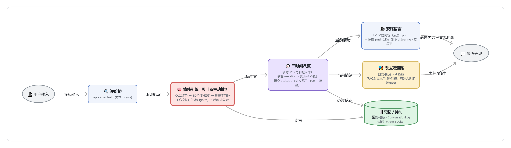
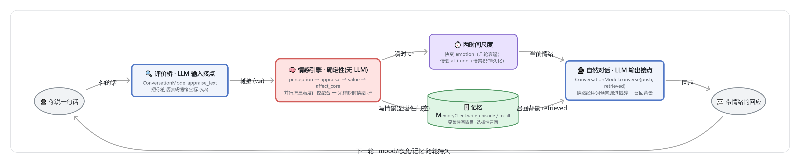

# Zero — 情感引擎驱动的 AI 数字人

> 让机器**带着情绪**说话。Zero 以一套**情感引擎**为内核、以 **LLM** 为语言外壳：每一句话先被读成情绪、在引擎里按人类情感动力学演化，再由语言与表情把这份情绪自然地漏出来——不是让模型"扮演"情绪，而是让情绪真实地参与生成。

情感引擎融合了五个学科的建模视角：

- **数学** — 贝叶斯主动推断、动力系统、在线价值学习
- **心理学** — OCC 评价理论、效价-唤醒环状模型、情绪调节、评价性条件作用
- **生物学** — 面部动作单元（FACS）、自主神经生理反应
- **神经科学** — 预测编码、全局工作空间点燃、显著网络门控、杏仁核多通路、多巴胺奖赏预测误差
- **计算科学** — 多 Agent 编排（LangGraph）、多网络并行

---

## 情感引擎是怎么做的

把"人产生并表达情绪"的过程，建模成一条**贝叶斯流水线**——感知一句话、推断出此刻的情绪、让它随时间演化、再分两路外化为语言和表情。



### 1. 评价桥：把话读成情绪

每一句输入先经**评价桥**反推出效价-唤醒坐标 `(v, a)`——一句夸奖是正效价、一句挑衅是负效价高唤醒——作为刺激喂给引擎。

### 2. 情感引擎核心：贝叶斯主动推断 + 显著度门控工作空间

引擎不是简单地"查表给情绪"，而是把多条**并行的功能流**竞争整合成一个全局情绪状态：

- **OCC 评价流** — 按目标契合度 / 标准符合度 / 对象吸引力给出情绪先验；
- **价值流** — 在线的 TD 奖赏预测误差与精度（对惊喜、对确定性的敏感）；
- **生存流** — 快速、低精度的亚符号信号（突如其来的巨响先于"这是什么"就拉高唤醒）；
- **语义流** — 文本/语义读出的情绪作为一条**独立、低精度**的高阶先验汇入（语言是高阶皮层的 top-down 预测，与评价、感官流并列竞争而非互相覆盖）；
- **显著度门控点燃** — 各流各出一个 `(均值, 精度)`，由显著网络打分，只有**过阈的流被"点燃"广播**进全局工作空间（全局工作空间理论的 ignition），其余停留局部、不空播；
- **精度加权融合 + 后验采样** — 点燃的流按精度加权融合，采样出此刻的**瞬时情绪 e\***（随机性让同一刺激也有细微波动）。

### 3. 三时间尺度：情绪会退、态度会沉淀

人的情绪不是一锤子，而是**多个时间尺度叠加**：

- **瞬时 `e*`** — 每个刺激当下采样出的情绪；
- **快变 `emotion`** — 短时情绪，被 e\* 冲击后**几轮内向基线衰退**（怒火飙起后会回落；衰退太慢反而是病理性的情绪惯性）。对外表达取的是它；
- **慢变 `attitude`** — 对**特定对象**的长期态度，按情绪缓慢累积、多轮才成形，是快变情绪衰退回归的基线。**持续**被冒犯才会真的变冷，偶尔被呛一下会过去。**只有态度被持久化**，重启后情绪归于态度基线。
- **稳态回弹** — 情绪与态度都带一份**回到平静的拉力**（向个体中性基线弱回归）：再热烈或再低落，只要没有持续刺激就会慢慢回稳，不会"越聊越上头"或陷在某个极端里出不来（affective homeostasis；情绪基线本身也是态度与中性的混合，不随态度无限上漂）。

于是对话有了"脾气"：被骂会不快、道歉能缓和、但一时的情绪不会永久定义这段关系，也不会因一路投入就单调滑向极端。

### 4. 双路语言：命题靠 LLM，情绪靠"漏"

借鉴语言的皮层/皮层下双通路：

- **Pull（皮层 · 随意）** — LLM 负责**命题内容**，根据上下文与检索把"要说什么"组织成话；
- **Push（皮层下 · 不随意）** — 情绪经**用词倾向 / logit 偏置 / 隐状态 steering** 自动**漏进**输出，而不是给模型一句"请表现得很生气"。

情感**辅佐而非替换**语言：它改变措辞的温度、节奏、边界感，让回应自然带情绪，而非戏剧化地演情绪。

### 5. 表达双通路：自发与随意 × 多通道

最终表现分**自发**（真情流露）与**随意**（社交掩饰）两条通路，落到多个表达通道——面部动作单元（FACS AU）、文本标签、生理信号、语音韵律。

### 6. 记忆 / 持久：短时注意力 ⊗ 长时记忆

多层记忆让数字人**跨重启记得你**，并在"当下注意得过来"与"长期记得住"之间架一座桥：

- **对话运行态** — transcript 与对此人的长期态度落本地 SQLite，重启续上；态度还作为先验**偏置当下的情绪评价**（持续被冒犯，连初见的反应都会变冷）。
- **短时注意力（工作记忆窗）** — 喂给 LLM 的上下文不是简单截最近 N 轮，而是**首因 + 近因的 U 形窗**：既记得"第一次见面说的话"、也记得最近几轮（借鉴系列位置效应，避免单调截断丢掉开场）。
- **情景记忆 + 三维召回** — 把对话经历按**情绪显著性**择要写成情景 episode（平淡的不记，借鉴海马"情绪/新颖性门控"）；召回时按 **新近性 × 相关性 × 重要性** 三维加权排序（幂律时序衰减 · 语义相似 · 写入显著度），高分的旧记忆**升入注意力预算、与近期对话同台竞争**（对应皮层记忆重激活），而非旁路堆砌——于是它**记得你聊过什么**、且只在相关时想起来。
- **约定记得住、记不清就直说** — 含时间 / 地点 / 承诺的内容，即使当时情绪平淡，也经**语义重要性通道**单独入库（不被情绪显著性门挡掉），日后能答"我们约的几点"；而真记不清时会**坦诚说"不记得"**，不编造、也不拿脾气搪塞（事实优先于情绪）。
- **遗忘是特性** — 长期事实带**时序失效**（新事实使旧失效）、情景库有**容量上限**，靠自然沉降而非物理删除来遗忘；确定性图谱 + 语义召回侧信道并存，语义侧信道失败绝不拖垮主对话。

> 记忆写什么/何时写/怎么召回/怎么排序，都经**跨学科科学家议会**评审定调（强制现场引文），且**全程确定性、不让 LLM 替数字人"编造"或"挑选"记忆**。一键恢复出厂：`python -m tools.reset_db --yes`。

---

## 项目运作流程：LLM ⊗ 情感引擎

把上面的情感引擎接进一次完整对话——**LLM 只在「输入」「输出」两端与它结合**（图中两个蓝框）：输入端把你的话**读成情绪**，输出端**被情绪调制着说话**；夹在中间产生情绪的是那套**确定性引擎**（红框，无 LLM），LLM 既不进情绪计算热路径、也不替数字人"编造"记忆。



### 关键接口各自的作用（LLM ⊗ 情感接点已标注）

| 接口 / 节点 | 作用 |
| --- | --- |
| `ConversationModel.appraise_text(text) → (v,a)` | **评价桥 · LLM 输入接点**：把你的话读成情绪坐标，作为刺激喂给引擎 |
| `ConversationModel.converse(history, affect, *, retrieved, push)` | **自然对话 · LLM 输出接点**：按当前情绪 + 召回背景生成回应，情绪经用词倾向自然漏进措辞 |
| `LanguageModel.generate → LanguageDraft` | 图内 `language` 节点协议：研究模式的 affect↔language 双向收敛回路（`python main.py --llm`） |
| `ChannelDecoder`（鸭子类型注入） | 表达通道解码器：`(v,a)` → 韵律 / 生理 / 表情，可换成训练好的网络，编排层不依赖 torch |
| `MemoryClient`：`write_episode` / `recall` · `write` / `query` | 记忆读写 API：语义情景记忆（显著性写入 / 选择性召回）+ 确定性长期倾向（图谱·时序失效）；**上层不直连图谱**、写入只在任务完成节点（节流） |
| 图节点链 `perception → appraisal → value → affect_core → mood → expression → supervisor`（+ `memory_recall`） | 情感引擎各环：感知 → 评价先验(含长期态度/召回偏置) → 价值学习 → 显著度门控融合采样 `e*` → 慢心境 → 多通道表达 → 任务完成节流写记忆 |
| 入口 `build_graph` · `runner.ConversationSession` · `main.py` | 装配并编译图 · 多轮会话基元（mood/价值/记忆跨轮持久）· CLI（`python main.py` 即进对话） |

> 各接口均**协议化、可注入**（真 LLM / 占位模板 / steering 后端、真网络解码器、记忆后端都按协议替换），编排层不绑定具体 SDK——这是"先把对话做扎实、再逐步接多模态"而不动内核契约的底座。

---

## 预留给未来的通道

现阶段以**文本输入、情绪化文本输出**跑通整条回路，同时把若干扩展点的**接口先留好**，未来逐步接入而不动内核契约：

| 方向 | 现在 | 预留的未来通道 |
| --- | --- | --- |
| **表达解码器** | 各通道用确定性占位函数 | 每个通道可**换成可训练网络**（韵律 RAVDESS / 生理 WESAD / 表情 AffectNet / 文本→VAD EmoBank），经鸭子类型协议注入，编排层不依赖 torch |
| **输入感知** | 文本 → `(v, a)` | 视觉图像 / 心电（ECG）/ 语气 / 面部表情 → 更丰富的多通道感知 |
| **输出形态** | 情绪化文本 + 通道值 | Live2D 形象 / 情感 TTS 等多模态外化 |
| **记忆与经历** | 对话+态度落盘、情景择要落库 + 新近×相关×重要三维召回 + 首因/近因注意力窗 | 完整睡眠巩固/遗忘曲线、稳定人格/自我模型、跨会话人物画像 |
| **运行后端** | 默认本地（内存 / SQLite） | env 一键切容器化 Postgres / Neo4j，接入真实图谱与运行态持久 |

---

## 项目结构

三层架构，依赖**单向**：编排 → 记忆 → 存储。

```text
Zero/
├── main.py                  # CLI 入口：默认 python main.py 即进对话；--workspace / --llm / --trace
├── src/
│   ├── orchestration/       # 编排层：StateGraph 装配 + 运行入口
│   │   ├── graph.py         #   build_graph：节点装配 + 条件边路由
│   │   ├── state.py         #   AffectState / Stimulus（结构化 state，含 recalled_facts）
│   │   ├── supervisor.py    #   协调 + 任务完成节流写记忆 + first_contact 首因标记
│   │   ├── memory_recall.py #   长期倾向回灌先验 + 召回三维重排（新近×相关×重要，Hill 归一）
│   │   ├── chat_driver.py   #   交互对话核心：两时间尺度情绪 + U形注意力窗 + 高显著召回注入
│   │   └── runner.py        #   跑刺激序列 + 多轮对话会话（ConversationSession）
│   ├── agents/              # 各 Worker（节点契约 (state) -> dict 只回增量）
│   │   ├── affect_math.py   #   数学内核：OCC/TD/精度/高斯融合·工作空间·三时间尺度
│   │   ├── perception.py · appraisal.py · value.py
│   │   ├── affect_core.py   #   主动推断·后验采样 e*（并行流竞争 + ignition）
│   │   ├── mood.py          #   慢变心境双稳动力学
│   │   ├── regulation.py · expression.py   # 掩饰 + 双通路·多通道输出
│   │   ├── language.py · language_openai.py   # 语言生成+双向回路 / ConversationModel 协议 / 评价桥 / 自然对话
│   │   ├── emotion_lexicon.py    #   细粒度情绪词 / 动机系统 / VAD 词典桥 / 时间包络
│   │   ├── language_steering.py  #   VA steering 适配器（开放权重）
│   │   ├── models/          #   可训练 torch 解码器（expression/prosody/physiology/facs/text）
│   │   └── datasets/        #   DataLoader：synthetic / ravdess / wesad / emobank / facs
│   ├── memory/              # 记忆层：读写 API（显式 scope、任务完成节流、后端失败隔离 + Fact.sim）
│   ├── storage/             # 存储层（最底层）：运行态 + 长期记忆，env 选后端
│   │   ├── checkpointer.py  #   memory / sqlite(异步 AsyncSqliteSaver) / postgres(待异步接线)
│   │   ├── graph_store.py   #   门面 + 工厂
│   │   └── backends/        #   deterministic（InMemory/Sqlite/Neo4j）+ semantic（Graphiti/SqliteVector）
│   └── observability/       # 横切：统一日志 setup_logging（每启动落 logs/、级别可配、入口无关）
├── tests/                   # 单测 + 行为/记忆回归
├── scripts/                 # 训练脚本 train_*.py + 端到端 demo_pipeline.py
├── tools/                   # 运维脚本（reset_db.py 清库）
├── docs/                    # 对外框架图 + 运作流程图（whiteboard-cli 渲染）
├── diagrams/                # 架构设计图谱系
├── notes/                   # 研究笔记 / 科学家议会决策 / 工程实践（情感数学·文本输出·工作空间·路线图·记忆路由…）
├── Dockerfile · docker-compose.yml · .env.example   # 容器化部署
└── pyproject.toml · environment.yml                 # 依赖与环境（core + ml/llm/nlp/steer/db 默认装；graphiti 按需）
```

---

## 快速开始

环境用 conda 管理（环境名 `affective-expression`，Python 3.12，依赖口径以 `pyproject.toml` 为准；也支持 `uv sync`）。

```powershell
# 1. 建环境
conda env create -f environment.yml
conda activate affective-expression

# 2. 直接对话：情感引擎 ⊗ LLM（缺 LLM key 自动回退词典 + 模板，仍演示情绪演化）
python main.py

# 3. 看显著度门控工作空间：每个刺激点燃了哪些并行流
python main.py --workspace

# 4. 核心管线 (v,a) 轨迹 JSON
python main.py --trace
```

接**真 LLM**（OpenAI 兼容接口，本地 vLLM / 第三方网关皆可）需 `llm` extra 并在 `.env` 配置——配置只走 `.env`，代码不写死模型默认：

```powershell
pip install -e ".[llm]"
# .env 内：
#   ZERO_OPENAI_API_KEY=sk-...                  # 必填
#   ZERO_OPENAI_MODEL=<你的 key 可访问的模型 id>  # 必填
#   ZERO_OPENAI_BASE_URL=https://.../v1          # 可选
python main.py            # 真模型对话
python main.py --llm      # 四情绪场景的文本输出情绪验证（批处理）
```

**真网络化**（把表达通道换成训练好的网络）需 `ml` extra，数据集获取见 **[DATASETS.md](DATASETS.md)**：

```powershell
pip install -e ".[ml]"
python -m scripts.train_prosody --root data/ravdess --epochs 300   # 权重存 artifacts/，再注入管线
python -m scripts.demo_pipeline                                    # 端到端：合成训练 → 注入 → 跑（无需外部数据）
```

> 预训练权重可从 Release [`weights-v0.2`](https://github.com/WizardHeHeJun/Zero/releases/tag/weights-v0.2)（真实数据训练）下载，放入 `artifacts/` 即用。

> **日志与排障**：每次启动落一份 `logs/zero-<时间戳>.log`；排障时 `ZERO_LOG_LEVEL=DEBUG python main.py ...` 可看每轮引擎 `e*`、记忆读写、LLM 请求/响应等详情，默认 `INFO` 保持安静、不打扰对话。

---

## 可调参数（按需微调对话行为）

默认开箱即用；想调「记多久 / 情绪多稳 / 召回多严」时，在 `.env` 设下列变量即可。完整清单见 [.env.example](.env.example)；各 knob 的**设计依据**见 [PROGRESS.md](PROGRESS.md) 与 [notes/](notes/) 议会纪要。

| 变量 | 默认 | 作用 |
| --- | --- | --- |
| `ZERO_HISTORY_WINDOW` | 40 | 喂给 LLM 的工作记忆窗总条数（越大记越久、也越费 token） |
| `ZERO_HISTORY_PRIMACY_K` | 5 | 窗内保留的「最初几条」（首因），其余留给最近几轮（近因） |
| `ZERO_EMOTION_BASELINE_ATTITUDE_W` | 0.6 | 情绪回落基线里「对此人态度」的占比；`<1` 给情绪一份回到平静的拉力（防越聊越上头） |
| `ZERO_RECALL_SIM_MIN` | 0.65 | 召回相似度下限（越高越只在强相关时才想起旧事） |
| `ZERO_RECALL_INJECT_MIN` | 0.5 | 旧记忆「升入当前注意力」与近期对话同台竞争的重要性门槛 |
| `ZERO_EPISODE_SALIENCE_MIN` | 0.15 | 情景记忆写入的情绪显著度门（越低记得越多；含时间/约定的内容总会被记下） |
| `ZERO_EPISODE_MAX_PER_KEY` | 0（`python main.py` 默认 300） | 单人情景记忆条数上限，满了删最旧（0=不限） |

> 留空即用上表默认；想还原更早的行为逐项设回旧值即可（如窗口设回 `20`、`ZERO_EMOTION_BASELINE_ATTITUDE_W=1`）。运行后端（SQLite/Postgres/Neo4j）与 LLM/embedding 的配置见上节「快速开始」与 `.env.example`。

---

## 文档

- **[docs/](docs/README.md)** — 对外框架图 + 运作流程图（whiteboard-cli 渲染）
- **[DATASETS.md](DATASETS.md)** — 真网络化所需数据集清单（获取方式 / 许可）
- **[notes/](notes/)** — 研究笔记：情感数学、文本输出情绪、并行脑路与工作空间、数字人路线图
